# ⚡ Distributed Cache — Complete System Design Guide

> **Study Guide** | Author: Manas Ranjan Dash | Level: Senior → Staff Engineer
>
> A production-grade deep dive into designing a distributed caching layer — from eviction policies and consistency models to cache stampede prevention, Redis internals, and full observability.

---

## 📋 Table of Contents

1. [What is a Distributed Cache?](#1-what-is-a-distributed-cache)
2. [Why Do We Need One?](#2-why-do-we-need-one)
3. [Clarifying Requirements](#3-clarifying-requirements)
4. [High-Level Architecture](#4-high-level-architecture)
5. [Caching Strategies](#5-caching-strategies)
6. [Eviction Policies](#6-eviction-policies)
7. [Data Layer — Redis vs Memcached](#7-data-layer--redis-vs-memcached)
8. [Consistent Hashing & Sharding](#8-consistent-hashing--sharding)
9. [Cache Invalidation](#9-cache-invalidation)
10. [Failure Modes & Resilience](#10-failure-modes--resilience)
11. [Cache Stampede Prevention](#11-cache-stampede-prevention)
12. [API Contract](#12-api-contract)
13. [Scalability & Capacity Planning](#13-scalability--capacity-planning)
14. [Observability](#14-observability)
15. [Advanced Topics](#15-advanced-topics)
16. [Interview Cheat Sheet](#16-interview-cheat-sheet)

---

## 1. What is a Distributed Cache?

A **distributed cache** is a shared, in-memory data store that sits between your application and its primary database. It stores frequently accessed data in RAM so that repeated reads are served in microseconds rather than milliseconds — without hitting the database every time.


### Key Vocabulary

| Term | Definition |
|------|-----------|
| **Cache Hit** | Requested data found in cache → fast path |
| **Cache Miss** | Data not in cache → must fetch from DB |
| **Hit Rate** | `hits / (hits + misses)` — higher is better (target > 90%) |
| **TTL (Time-To-Live)** | Expiry duration for a cache entry |
| **Eviction** | Removing entries when cache is full |
| **Invalidation** | Proactively removing stale entries when source data changes |
| **Cache Warm-up** | Pre-loading cache before traffic hits |
| **Hot Key** | A single key accessed extremely frequently — can become a bottleneck |

---

## 2. Why Do We Need One?

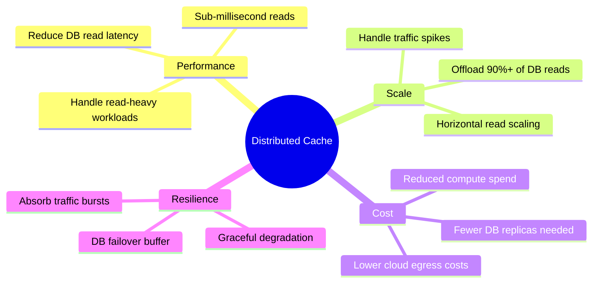

### Real-World Impact

| Without Cache | With Cache |
|--------------|-----------|
| DB query: 20–50ms | Cache read: 0.1–1ms |
| DB handles 10k RPS | Cache handles 1M+ RPS |
| Every user hits DB | 95% of reads served from RAM |
| DB CPU at 80% under load | DB CPU at 15% |

---

## 3. Clarifying Requirements

> 🏆 Before designing, always ask these. A 10k RPS cache looks completely different from a 1M RPS one.

### Questions to Always Ask

```
1. READ/WRITE RATIO?
   → Read-heavy (social feed, product catalog) → aggressive caching
   → Write-heavy (real-time analytics) → caching less valuable

2. DATA CHARACTERISTICS?
   → How large is each cached object? (100 bytes vs 10MB makes a big difference)
   → How frequently does source data change?
   → Is stale data acceptable? (eventual consistency OK vs must be fresh)

3. CONSISTENCY REQUIREMENTS?
   → Strong consistency needed? (financial data, inventory)
   → Eventual consistency OK? (social feeds, recommendations)

4. SCALE?
   → Total requests per second?
   → Total unique keys / dataset size?
   → Geographic distribution? (single region vs multi-region)

5. FAILURE BEHAVIOUR?
   → What happens when cache is unavailable? (fail to DB vs full outage)
   → Acceptable data loss on crash? (in-memory only vs persistence)

6. TTL STRATEGY?
   → Fixed TTL per type?
   → Event-driven invalidation (invalidate on write)?
   → Both?
```

### Our Problem Statement (Assumed)

| Parameter | Value |
|-----------|-------|
| Scale | 1M reads/sec, 50k writes/sec (20:1 read:write ratio) |
| Dataset | 500GB total, hot working set ~50GB |
| Object size | 1KB average |
| Latency target | p99 < 2ms for cache hits |
| Consistency | Eventual — 1–5s stale is acceptable |
| Failure mode | Fail to DB (degrade gracefully) |
| Availability | 99.99% (< 1hr downtime/year) |

---

## 4. High-Level Architecture

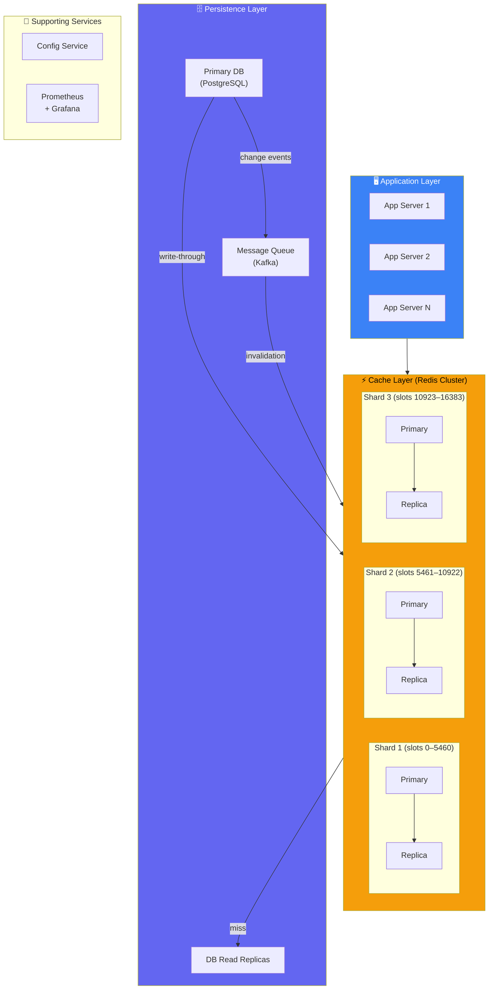

### Request Flow — Cache Hit vs Miss

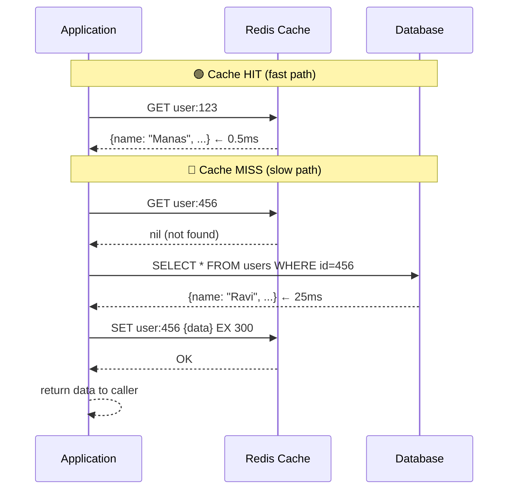

---

## 5. Caching Strategies

This is the most important design decision. Each strategy has distinct consistency and complexity trade-offs.

### 5.1 Cache-Aside (Lazy Loading) ⭐ Most Common

The application manages the cache manually. Read from cache first; on miss, load from DB and populate cache.

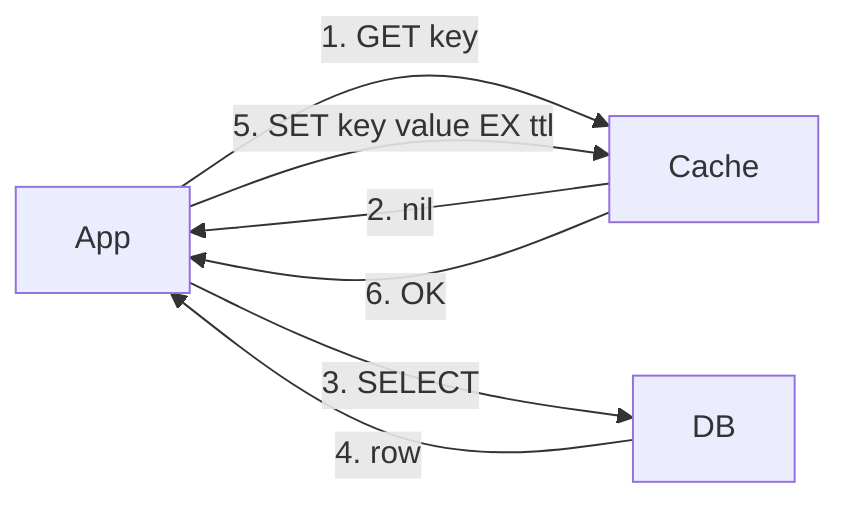

```python
def get_user(user_id: str) -> dict:
    # 1. Try cache first
    cached = redis.get(f"user:{user_id}")
    if cached:
        return json.loads(cached)              # Cache HIT ✅

    # 2. Cache MISS — go to DB
    user = db.query("SELECT * FROM users WHERE id = %s", user_id)

    # 3. Populate cache with TTL
    redis.setex(f"user:{user_id}", 300, json.dumps(user))

    return user                                # Cache MISS, DB fallback ⚠️
```

```
✅ Pros:
  - Only requested data is cached (no wasted memory)
  - Cache failure doesn't break reads (falls back to DB)
  - Works for any data source

❌ Cons:
  - First request always slow (cold start)
  - Window of stale data between DB write and cache TTL expiry
  - Cache and DB can diverge (eventual consistency only)

Best for: Read-heavy workloads, large datasets, tolerable staleness
```

---

### 5.2 Write-Through

On every write to DB, also write to cache synchronously.

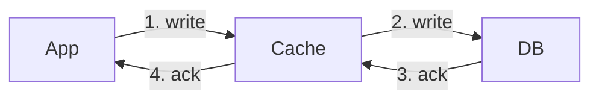

```python
def update_user(user_id: str, data: dict):
    # Write to DB and cache atomically
    db.execute("UPDATE users SET ... WHERE id = %s", user_id)
    redis.setex(f"user:{user_id}", 300, json.dumps(data))   # Always fresh ✅
```

```
✅ Pros:
  - Cache always consistent with DB
  - No stale reads after a write
  - Read performance excellent after first write

❌ Cons:
  - Every write has double latency (cache + DB)
  - Cache polluted with rarely-read data
  - Cache node failure on write = data loss risk

Best for: Write + read heavy with strong consistency needs (user profiles, settings)
```

---

### 5.3 Write-Behind (Write-Back)

Write to cache immediately, asynchronously flush to DB later.

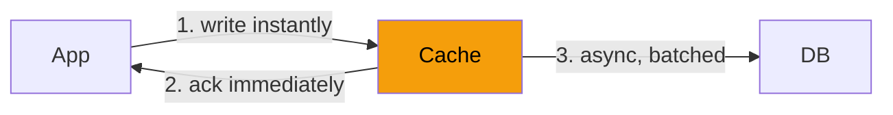

```
✅ Pros:
  - Lowest write latency — app gets ack from cache, not DB
  - Batched DB writes reduce load dramatically
  - Great for high-write workloads (analytics, counters)

❌ Cons:
  - Data loss risk if cache crashes before flush
  - Complex implementation — need durable write queue
  - DB and cache can diverge during flush window

Best for: Write-heavy, loss-tolerant workloads (view counters, analytics events)
```

---

### 5.4 Read-Through

Cache sits in front of DB. On miss, cache itself loads from DB (not the application).

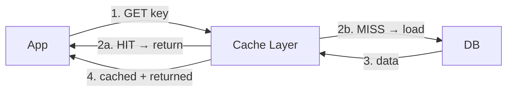

```
✅ Pros:
  - Application code stays clean — no cache logic in app
  - Consistent loading pattern

❌ Cons:
  - Cache must be configured with a data loader
  - First request still slow
  - Less flexible than cache-aside

Best for: When using a managed caching solution (DAX for DynamoDB, etc.)
```

---

### Strategy Comparison

| Strategy | Consistency | Latency (Write) | Complexity | Best For |
|----------|------------|-----------------|------------|----------|
| **Cache-Aside** | Eventual | Normal | Low | Read-heavy, large datasets |
| **Write-Through** | Strong | 2× slower | Medium | Profiles, settings |
| **Write-Behind** | Eventual | Fastest | High | Counters, analytics |
| **Read-Through** | Eventual | Normal | Low | Managed cache solutions |

---

## 6. Eviction Policies

When the cache is full and a new key must be inserted, an old key must be evicted. This choice directly affects hit rate.

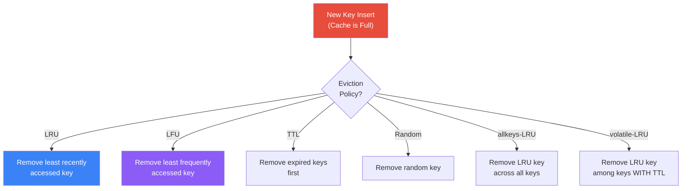

### Redis Eviction Policies

| Policy | Description | Use When |
|--------|-------------|----------|
| `noeviction` | Return error when full | Never for a cache (use for session store) |
| `allkeys-lru` | Evict least recently used across ALL keys | ✅ General purpose cache |
| `volatile-lru` | Evict LRU keys that have a TTL set | When mixing persistent + cache keys |
| `allkeys-lfu` | Evict least frequently used (Redis 4+) | ✅ Skewed access patterns (some keys much hotter) |
| `volatile-ttl` | Evict keys with shortest TTL remaining | When TTL reflects importance |
| `allkeys-random` | Evict random key | Uniform access patterns |

### LRU vs LFU — The Key Distinction

```
LRU (Least Recently Used):
  - Good when recent = relevant (e.g. user session data)
  - Problem: a key accessed 1000 times yesterday but not today gets evicted
             in favor of a key accessed once today

LFU (Least Frequently Used):
  - Good for skewed popularity (e.g. viral content, hot product pages)
  - Keeps items that are accessed many times even if not recently
  - Problem: new keys start with frequency=0 and are at eviction risk
  - Redis 4+ uses a decaying counter to handle this

Rule of thumb:
  → Use allkeys-lru for most caches
  → Use allkeys-lfu if you have strong power-law access distribution
    (a small % of keys get the vast majority of traffic)
```

### Configuring Redis Eviction

```bash
# redis.conf
maxmemory 50gb
maxmemory-policy allkeys-lru

# Or at runtime:
redis-cli CONFIG SET maxmemory 50gb
redis-cli CONFIG SET maxmemory-policy allkeys-lru
```

---

## 7. Data Layer — Redis vs Memcached

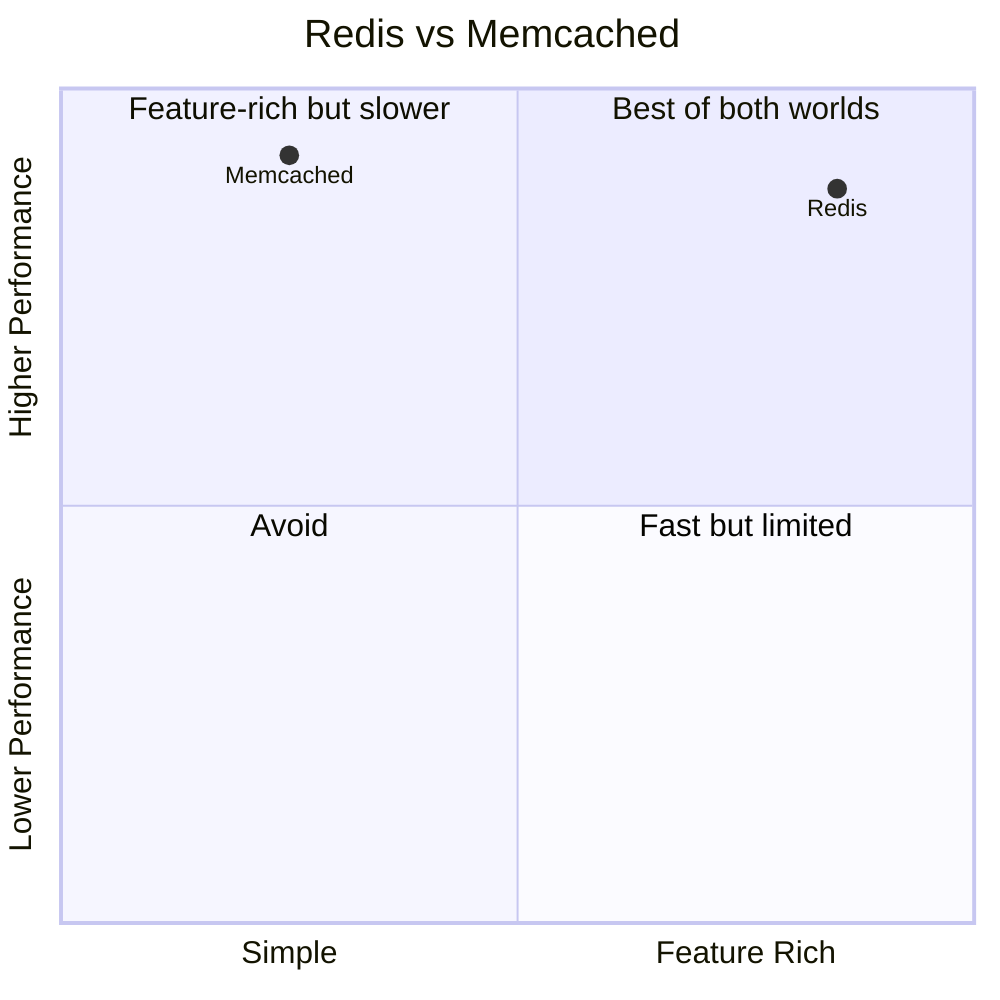

### Detailed Comparison

| Feature | Redis | Memcached |
|---------|-------|-----------|
| **Data structures** | String, Hash, List, Set, ZSet, Stream, Bitmap, HyperLogLog | String only |
| **Persistence** | ✅ RDB snapshots + AOF log | ❌ In-memory only |
| **Replication** | ✅ Primary-Replica | ❌ No native replication |
| **Clustering** | ✅ Redis Cluster (16,384 slots) | ✅ Client-side consistent hashing |
| **Lua scripting** | ✅ Atomic multi-step ops | ❌ No |
| **Pub/Sub** | ✅ | ❌ |
| **Transactions** | ✅ MULTI/EXEC | ❌ |
| **Throughput** | ~1M ops/sec (single node) | ~1.2M ops/sec (slightly faster per node) |
| **Memory efficiency** | Good | Slightly better (no overhead for rich types) |
| **Horizontal scale** | Redis Cluster | Multi-threaded (better CPU use per node) |

### ✅ Our Choice: Redis

**Reasoning:**
1. We need **persistence** (RDB) — if cache warms up over hours and then crashes, we don't want a cold start
2. We use **Lua scripts** for atomic multi-step operations (e.g. cache stampede prevention)
3. We need **Pub/Sub** for cache invalidation fanout across replicas
4. **Rich data structures** — ZSets for leaderboards, sorted feeds; Hashes for user objects
5. Redis Cluster handles our sharding natively

> Use Memcached only if: you need maximum raw throughput for simple string key-value data and have no need for persistence, scripting, or rich types.

### Redis Persistence Options

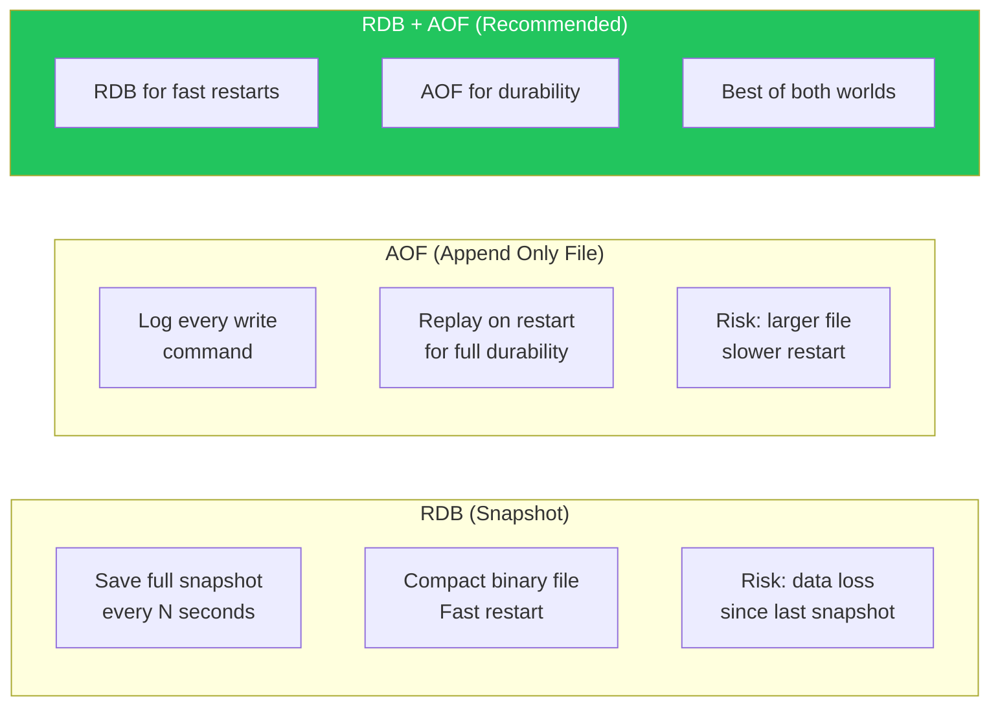

```bash
# redis.conf — recommended for a cache that should survive restarts
save 900 1          # Snapshot if 1 key changed in 900s
save 300 10         # Snapshot if 10 keys changed in 300s
save 60 10000       # Snapshot if 10000 keys changed in 60s

appendonly yes
appendfsync everysec  # Flush AOF every second (balance durability vs perf)
```

---

## 8. Consistent Hashing & Sharding

At scale, a single Redis node won't hold all data. We shard across multiple nodes.

### The Problem with Naive Modulo Hashing

```
Naive: shard = hash(key) % N

Problem: when N changes (add/remove node),
  ALL keys remap → massive cache miss storm
  hash("user:123") % 3 = 0
  hash("user:123") % 4 = 2  ← different node!
```

### Consistent Hashing

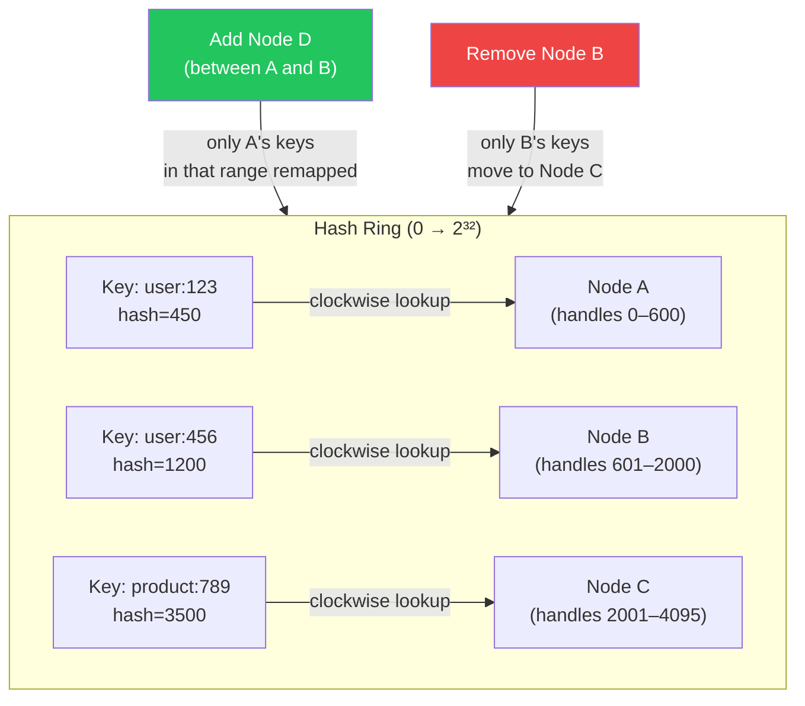

**Key property:** When a node is added or removed, only `K/N` keys need to remigrate (where K = total keys, N = node count). Compare to modulo hashing where ALL keys remigrate.

### Virtual Nodes (VNodes)

Real consistent hashing uses **virtual nodes** — each physical node maps to many positions on the ring — for more even distribution:

```
Without VNodes:
  Node A → 1 position → uneven distribution
  Node B → 1 position → some nodes get 2× data

With VNodes (e.g. 150 virtual nodes per physical node):
  Node A → 150 positions on ring → even distribution
  Node B → 150 positions on ring → even distribution
```

### Redis Cluster Slot Assignment

Redis Cluster uses a fixed hash space of **16,384 slots**:

```
hash_slot = CRC16(key) % 16384

Default distribution for 3 shards:
  Node 1: slots    0 – 5460
  Node 2: slots 5461 – 10922
  Node 3: slots 10923 – 16383
```

```mermaid
gantt
    title Redis Cluster Slot Distribution (3 Shards)
    dateFormat X
    axisFormat %s

    section Node 1 (Primary + Replica)
    Slots 0–5460         :done, 0, 5460

    section Node 2 (Primary + Replica)
    Slots 5461–10922     :done, 5461, 5461

    section Node 3 (Primary + Replica)
    Slots 10923–16383    :done, 10923, 5461
```

---

## 9. Cache Invalidation

> "There are only two hard things in computer science: cache invalidation and naming things." — Phil Karlton

### Why Is It Hard?

```
Write happens at T=0 in DB
Cache still has old value until:
  Option A → TTL expires naturally (eventual consistency gap = TTL window)
  Option B → Cache is explicitly invalidated on write (strong consistency)
  Option C → Hybrid: invalidate on write + short TTL as backstop
```

### Strategy 1: TTL-Based (Simplest)

Just let keys expire. Works when slight staleness is acceptable.

```python
# Set with a TTL — data expires automatically
redis.setex(f"product:{product_id}", ttl=60, value=json.dumps(product))
# Max staleness = 60 seconds
```

```
✅ Simple, no invalidation logic needed
❌ Stale window = full TTL duration
❌ Cache hit rate drops at mass-expiry boundaries (thundering herd)
```

---

### Strategy 2: Event-Driven Invalidation via Kafka

Write to DB → emit event → consumer invalidates cache key.

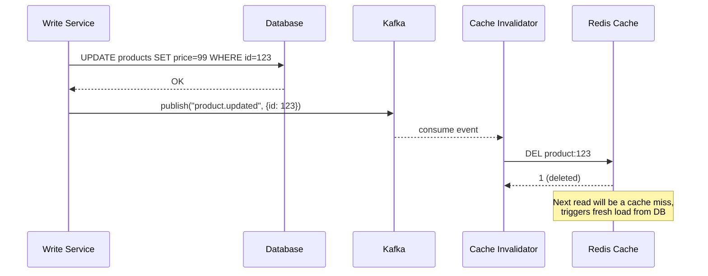

```python
# Kafka consumer — cache invalidator service
@kafka_consumer(topic="product.updated")
def on_product_updated(event: dict):
    product_id = event["id"]
    keys_to_invalidate = [
        f"product:{product_id}",
        f"product:detail:{product_id}",
        f"category:{event['category_id']}:products",  # also invalidate list cache
    ]
    redis.delete(*keys_to_invalidate)
    logger.info(f"Invalidated {len(keys_to_invalidate)} cache keys for product {product_id}")
```

```
✅ Near-real-time consistency
✅ Scales independently (Kafka buffers invalidation events)
❌ Extra infrastructure (Kafka)
❌ Cache miss spike on popular items being updated
```

---

### Strategy 3: Cache Versioning (Tag-Based Invalidation)

Use a version number per entity. Cache key includes version. Bump version = all old keys become orphans (naturally evicted by LRU/TTL).

```python
def cache_key(entity: str, entity_id: str) -> str:
    version = redis.get(f"version:{entity}:{entity_id}") or "1"
    return f"{entity}:{entity_id}:v{version}"

def invalidate(entity: str, entity_id: str):
    # Bump version — all old keys become unreachable
    redis.incr(f"version:{entity}:{entity_id}")

# Usage
key = cache_key("product", "123")   # → "product:123:v4"
redis.setex(key, 300, data)

# On product update:
invalidate("product", "123")        # → version becomes 5
# Old keys "product:123:v4" still exist but are never requested again
# They expire naturally via TTL
```

```
✅ No explicit DELETE needed — version bump is atomic and instant
✅ Old keys evicted by LRU naturally
❌ Old versioned keys consume memory until LRU evicts
```

---

## 10. Failure Modes & Resilience

### Failure Map

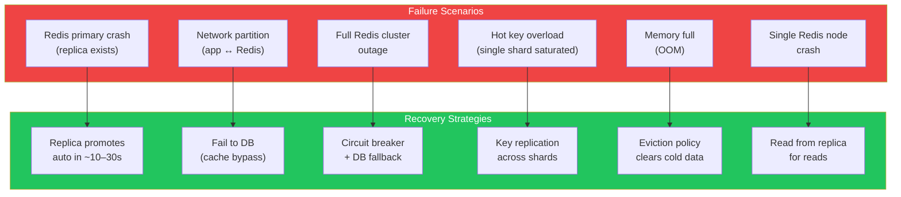

### Redis Sentinel vs Redis Cluster

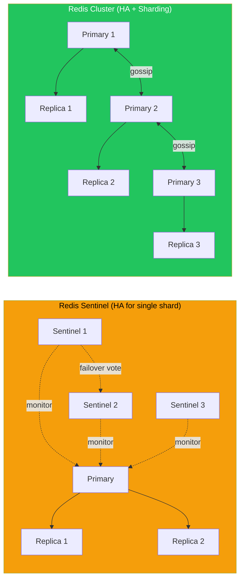

| | Redis Sentinel | Redis Cluster |
|--|----------------|--------------|
| Use case | Single shard with HA | Multi-shard HA + horizontal scale |
| Max data | ~100GB (single primary) | Virtually unlimited |
| Failover | ~10–30s (sentinel vote) | ~10s (cluster election) |
| Client complexity | Sentinel-aware client | Cluster-aware client (redirects) |
| Our choice | ❌ | ✅ Redis Cluster |

### Circuit Breaker for Cache

```python
class CacheCircuitBreaker:
    """
    Prevents thundering herd on DB when Redis is flapping.
    If Redis fails repeatedly, stop trying and go direct to DB.
    """
    def __init__(self, failure_threshold=5, recovery_timeout=30):
        self.failures = 0
        self.threshold = failure_threshold
        self.recovery_timeout = recovery_timeout
        self.state = "CLOSED"      # CLOSED | OPEN | HALF_OPEN
        self.opened_at = None

    def get(self, key: str, loader_fn):
        """Try cache; fall back to loader_fn on miss or circuit open."""
        if self.state == "OPEN":
            if time.time() - self.opened_at > self.recovery_timeout:
                self.state = "HALF_OPEN"
            else:
                return loader_fn()  # bypass cache entirely

        try:
            value = redis.get(key)
            if value:
                self._success()
                return json.loads(value)
        except RedisError:
            self._failure()
            return loader_fn()

        # Cache miss — load and populate
        data = loader_fn()
        try:
            redis.setex(key, 300, json.dumps(data))
            self._success()
        except RedisError:
            self._failure()
        return data

    def _success(self):
        self.failures = 0
        self.state = "CLOSED"

    def _failure(self):
        self.failures += 1
        if self.failures >= self.threshold:
            self.state = "OPEN"
            self.opened_at = time.time()
```

---

## 11. Cache Stampede Prevention

> 🔴 **Critical production topic.** Often missed in interviews. Hugely impactful in reality.

### The Problem

When a popular cache key expires, hundreds of concurrent requests all get a cache miss simultaneously, all go to the DB, all fetch the same data, all try to write it back. The DB gets hammered.

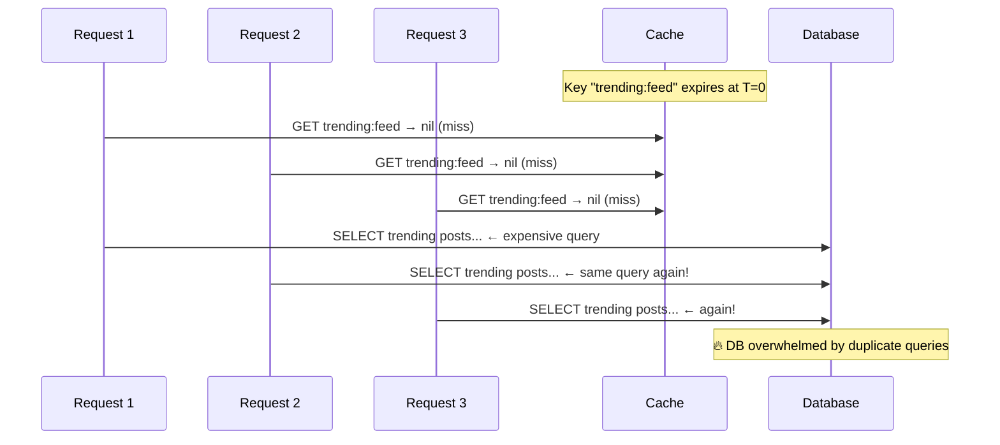

### Solution 1: Mutex / Distributed Lock

Only one request recomputes the value. Others wait.

```python
import redis.lock

def get_trending_feed():
    key = "trending:feed"
    lock_key = f"{key}:lock"

    # Try cache first
    cached = redis.get(key)
    if cached:
        return json.loads(cached)

    # Acquire distributed lock (only one winner)
    with redis.lock(lock_key, timeout=5, blocking_timeout=3):
        # Double-check after acquiring lock (another request may have populated)
        cached = redis.get(key)
        if cached:
            return json.loads(cached)

        # Recompute the value
        data = db.query("SELECT * FROM trending_posts LIMIT 100")
        redis.setex(key, 300, json.dumps(data))
        return data
    # All other requests waited and now get a cache hit
```

```
✅ Only one DB query fires
❌ Waiters are blocked (adds latency)
❌ Lock holder crash = all waiters timeout
```

---

### Solution 2: Probabilistic Early Expiry (PER) ⭐ Best

Proactively recompute the cache before it expires, based on a probability that increases as TTL decreases.

```python
import math, random

def get_with_per(key: str, loader_fn, ttl: int = 300, beta: float = 1.0):
    """
    Probabilistic Early Recomputation.
    Randomly recomputes the value before expiry to avoid stampedes.

    beta: controls aggressiveness (1.0 = standard)
    """
    result = redis.get(key)

    if result:
        data = json.loads(result)
        remaining_ttl = redis.ttl(key)
        recompute_time = data.get("_recompute_time", 0.001)  # time to recompute

        # Early expiry probability increases as TTL shrinks
        if -beta * recompute_time * math.log(random.random()) >= remaining_ttl:
            # Proactively recompute in background
            fresh_data = loader_fn()
            fresh_data["_recompute_time"] = recompute_time
            redis.setex(key, ttl, json.dumps(fresh_data))
            return fresh_data

        return data

    # True cache miss — compute and cache
    data = loader_fn()
    data["_recompute_time"] = 0.001
    redis.setex(key, ttl, json.dumps(data))
    return data
```

```
✅ No locks, no blocking
✅ Cache is always warm — zero cold misses
✅ Recomputation load smoothly distributed over time
❌ Slightly more DB reads (pre-emptive refresh)
```

---

### Solution 3: Stale-While-Revalidate

Serve stale data immediately; refresh in background.

```python
def get_stale_while_revalidate(key: str, loader_fn, ttl=300, stale_ttl=60):
    """
    Returns stale data immediately while refreshing async.
    stale_ttl: extra time beyond ttl where stale data is served
    """
    data = redis.get(key)

    if data:
        # Check if in "stale" window
        remaining = redis.ttl(key)
        if remaining < 0:  # expired but stale window
            # Serve stale, refresh async
            threading.Thread(target=lambda: _refresh(key, loader_fn, ttl)).start()
        return json.loads(data)

    # Hard miss
    fresh = loader_fn()
    redis.setex(key, ttl + stale_ttl, json.dumps(fresh))
    return fresh

def _refresh(key, loader_fn, ttl):
    fresh = loader_fn()
    redis.setex(key, ttl, json.dumps(fresh))
```

```
✅ Always returns instantly (even stale data is fast)
✅ No locking, no waiting
❌ Data can be stale by up to stale_ttl duration
```

---

## 12. API Contract

### Internal Cache Service Interface (gRPC)

```protobuf
syntax = "proto3";

service CacheService {
  rpc Get(CacheGetRequest) returns (CacheGetResponse);
  rpc Set(CacheSetRequest) returns (CacheSetResponse);
  rpc Delete(CacheDeleteRequest) returns (CacheDeleteResponse);
  rpc MGet(CacheMGetRequest) returns (CacheMGetResponse);    // batch get
  rpc MDelete(CacheMDeleteRequest) returns (CacheMDeleteResponse); // batch invalidate
}

message CacheGetRequest {
  string key = 1;
  bool return_ttl = 2;   // optionally return remaining TTL
}

message CacheGetResponse {
  bool found = 1;
  bytes value = 2;
  int32 remaining_ttl_seconds = 3;
  string cache_node = 4;   // which shard served this (for debugging)
}

message CacheSetRequest {
  string key = 1;
  bytes value = 2;
  int32 ttl_seconds = 3;
  bool nx = 4;   // SET only if Not eXists (atomic creation)
}

message CacheSetResponse {
  bool set = 1;   // false if nx=true and key already existed
}
```

### Python SDK

```python
@dataclass
class CacheResult:
    hit: bool
    value: Optional[Any]
    ttl_remaining: Optional[int] = None
    source: str = "cache"   # "cache" | "db" | "fallback"

class CacheClient:
    def __init__(self, redis_cluster: RedisCluster, default_ttl: int = 300):
        self.redis = redis_cluster
        self.default_ttl = default_ttl
        self.circuit_breaker = CacheCircuitBreaker()

    def get(self, key: str) -> CacheResult:
        try:
            val = self.redis.get(key)
            if val:
                return CacheResult(hit=True, value=json.loads(val))
            return CacheResult(hit=False, value=None)
        except RedisError:
            self.circuit_breaker.record_failure()
            return CacheResult(hit=False, value=None, source="fallback")

    def set(self, key: str, value: Any, ttl: int = None) -> bool:
        try:
            return self.redis.setex(key, ttl or self.default_ttl, json.dumps(value))
        except RedisError:
            return False

    def get_or_load(self, key: str, loader: Callable, ttl: int = None) -> Any:
        """Cache-aside pattern with circuit breaker built in."""
        result = self.get(key)
        if result.hit:
            return result.value
        data = loader()
        self.set(key, data, ttl)
        return data

    def invalidate(self, *keys: str) -> int:
        """Delete one or more keys. Returns count of deleted keys."""
        try:
            return self.redis.delete(*keys)
        except RedisError:
            return 0
```

---

## 13. Scalability & Capacity Planning

### Memory Sizing

```
Assumptions:
  Hot dataset = 50GB
  Average object = 1KB
  Redis overhead per key ≈ 50 bytes

Total keys = 50GB / 1KB = 50M keys
Total memory = 50M × (1000 + 50) bytes ≈ 52.5GB

With 20% headroom: ~63GB

→ 3 Redis primary nodes × 25GB RAM each = 75GB usable
  (with 1 replica each for HA)
```

### Throughput Sizing

```
Read RPS:  1,000,000 / sec
Write RPS:    50,000 / sec

Single Redis node: ~100,000–200,000 ops/sec

→ Reads: 1M RPS / 100k per node = 10 nodes minimum
  But reads can go to replicas! With 1 replica per shard:
  → 5 primaries + 5 replicas = 10 nodes, 1M+ RPS ✅

Writes go only to primaries:
  → 50k writes / 100k per node = 1 node sufficient
  → With 5 primaries, each handles ~10k writes/sec ✅

Final: 5 primary shards + 5 replicas = 10 Redis nodes
```

### Scaling Strategy

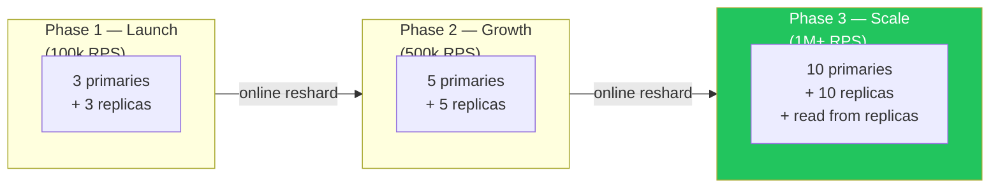

> Redis Cluster supports **online resharding** — slots can be migrated without downtime.

---

## 14. Observability

### Key Metrics

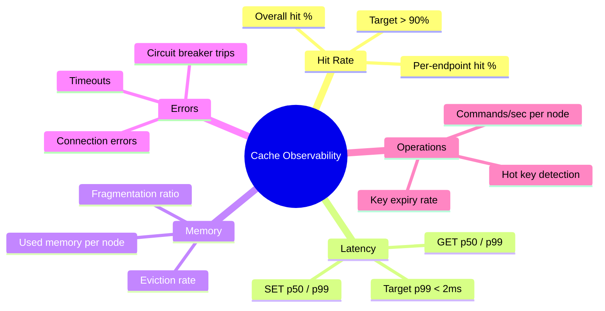

### Prometheus Metrics

```python
from prometheus_client import Counter, Histogram, Gauge

cache_ops = Counter(
    "cache_operations_total",
    "Cache operations",
    ["operation", "result"]     # operation: get|set|delete; result: hit|miss|error
)

cache_latency = Histogram(
    "cache_operation_duration_seconds",
    "Time for cache operations",
    ["operation"],
    buckets=[0.0001, 0.0005, 0.001, 0.005, 0.01, 0.05]
)

cache_memory = Gauge(
    "cache_memory_used_bytes",
    "Redis memory used",
    ["node"]
)

eviction_rate = Gauge(
    "cache_evictions_per_second",
    "Key evictions per second"
)
```

### Alert Rules

```yaml
groups:
  - name: cache
    rules:

      # Low hit rate = cache not doing its job
      - alert: CacheHitRateLow
        expr: |
          rate(cache_operations_total{result="hit"}[5m]) /
          rate(cache_operations_total{operation="get"}[5m]) < 0.85
        for: 5m
        severity: warning
        annotations:
          summary: "Cache hit rate below 85% — DB may be overloaded"

      # High latency = Redis under pressure
      - alert: CacheLatencyHigh
        expr: |
          histogram_quantile(0.99,
            rate(cache_operation_duration_seconds_bucket{operation="get"}[5m])
          ) > 0.002
        for: 2m
        severity: critical
        annotations:
          summary: "Cache GET p99 latency above 2ms"

      # High eviction = cache is too small
      - alert: CacheHighEvictionRate
        expr: eviction_rate > 1000
        for: 5m
        severity: warning
        annotations:
          summary: "Cache evicting >1000 keys/sec — consider increasing maxmemory"

      # Memory approaching limit
      - alert: CacheMemoryHigh
        expr: cache_memory_used_bytes / cache_memory_max_bytes > 0.90
        for: 5m
        severity: warning
        annotations:
          summary: "Cache memory >90% — eviction storm imminent"
```

---

## 15. Advanced Topics

### Multi-Level Caching (L1 + L2)

For ultra-low latency, use a two-layer cache:

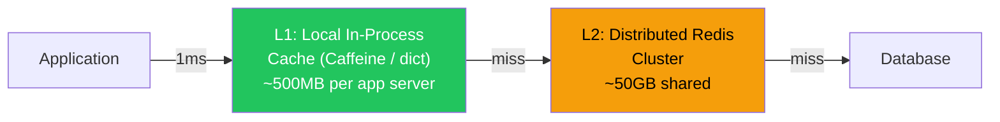

```python
from cachetools import TTLCache

# L1: in-process, 10k entries, 10s TTL (very fast, very fresh)
l1_cache = TTLCache(maxsize=10_000, ttl=10)

# L2: Redis (shared, 300s TTL)

def get_user(user_id: str) -> dict:
    key = f"user:{user_id}"

    # L1 check (nanoseconds)
    if key in l1_cache:
        return l1_cache[key]

    # L2 check (sub-millisecond)
    val = redis.get(key)
    if val:
        data = json.loads(val)
        l1_cache[key] = data       # backfill L1
        return data

    # DB (tens of milliseconds)
    data = db.get_user(user_id)
    redis.setex(key, 300, json.dumps(data))
    l1_cache[key] = data
    return data
```

### Hot Key Problem & Solutions

A hot key is one accessed so frequently it saturates a single Redis shard.

```
Example: "trending:homepage" → 50,000 reads/sec → all go to Shard 2
         Shard 2 CPU: 100% → latency spikes → cascades

Solutions:

1. LOCAL REPLICA: Cache the hot key in local in-process cache (L1)
   → 50k reads absorbed locally, zero Redis traffic

2. KEY SHARDING: Replicate to N shards, route randomly
   "trending:homepage:shard:0", "trending:homepage:shard:1" ... ":4"
   → Read from random shard → 10k RPS per shard

3. READ FROM REPLICAS: Direct reads of hot keys to replicas
   → Doubles read capacity for that shard
```

### Cache Warming Strategies

Avoid cold start after a deployment or Redis restart:

```python
# Strategy 1: Pre-warm on startup
async def warm_cache():
    """Run before accepting traffic after deployment."""
    top_users = db.query("SELECT id FROM users ORDER BY last_active DESC LIMIT 10000")
    for user_id in top_users:
        data = db.get_user(user_id)
        redis.setex(f"user:{user_id}", 300, json.dumps(data))
    logger.info("Cache warm-up complete: 10k users loaded")

# Strategy 2: Shadow traffic warm-up (replay recent access log)
# Strategy 3: RDB snapshot restore (Redis persists snapshot, reload on start)
```

---

## 16. Interview Cheat Sheet

### The Golden Flow

```
1. CLARIFY   → Read:write ratio? Staleness tolerance? Dataset size? Consistency needs?
2. STRATEGY  → Cache-aside (default), Write-through (consistency), Write-behind (speed)
3. TOOL      → Redis (rich types, Lua, persistence) vs Memcached (raw speed, simplicity)
4. EVICTION  → allkeys-lru (general), allkeys-lfu (power-law traffic)
5. SHARDING  → Consistent hashing / Redis Cluster slots (16,384)
6. STAMPEDE  → Mutex lock, Probabilistic Early Recomputation, Stale-While-Revalidate
7. FAILURES  → Circuit breaker → fail to DB; Replica promotion for node failure
8. OBSERVE   → Hit rate (>90%), latency p99 (<2ms), memory usage, eviction rate
```

### Common Interview Questions

| Question | Key Answer |
|----------|-----------|
| What is cache stampede? | Many simultaneous misses on same key hitting DB. Solve with lock, PER, or stale-while-revalidate |
| LRU vs LFU? | LRU: evict least recently used. LFU: evict least frequently used. Use LFU for power-law traffic |
| How do you keep cache consistent with DB? | TTL expiry (simple), event-driven invalidation (Kafka), version-based (tag invalidation) |
| Redis vs Memcached? | Redis: rich types, persistence, Lua, Pub/Sub. Memcached: simpler, slightly faster for plain K/V |
| What is consistent hashing? | Maps keys to a ring; add/remove node only remaps K/N keys (vs all keys in modulo) |
| How do you handle hot keys? | L1 local cache, key replication across shards, read from replicas |
| What happens if Redis goes down? | Circuit breaker → fail to DB. Use Sentinel or Cluster for automatic failover |
| How do you size a cache? | Hot dataset size + Redis key overhead + 20% headroom. Measure with `redis-cli info memory` |

### Numbers to Remember

| Metric | Value |
|--------|-------|
| Redis GET latency (local) | ~0.1–0.5ms |
| Redis ops/sec (single node) | ~100k–200k |
| Redis Cluster hash slots | 16,384 |
| Target hit rate | > 90% |
| Redis memory overhead per key | ~50–100 bytes |
| LRU approximation quality (Redis) | 5 sample default, 10 for near-perfect |
| Default Redis maxmemory-policy | `noeviction` (must change for cache use!) |

---

## 📚 Further Reading

- [Redis Documentation — Persistence](https://redis.io/docs/manual/persistence/) — RDB vs AOF deep dive
- [Redis Documentation — Cluster](https://redis.io/docs/manual/scaling/) — Cluster spec and slot assignment
- [Cloudflare Blog — Cache Stampede](https://blog.cloudflare.com/cache-stampede-prevention/) — PER at Internet scale
- [Facebook — TAO](https://engineering.fb.com/2013/06/25/core-data/tao-the-power-of-the-graph/) — Facebook's distributed cache for the social graph
- [Netflix — EVCache](https://netflixtechblog.com/announcing-evcache-distributed-in-memory-datastore-for-cloud-2011-8b43e3765e1) — Netflix's global distributed cache
- [Memcached vs Redis (Thorough Comparison)](https://redis.io/docs/getting-started/faq/)

---

*Study guide by Manas Ranjan Dash · Part of the [software-design](https://github.com/simplymanas/software-design) series*
*Prev: Rate Limiter | Next: Notification System*
