# ⚡ Hyper-Local Flash Inventory Sync — Complete System Design Guide

> **Study Guide** | Author: Manas Ranjan Dash | Level: Staff Engineer → Principal
>
> A first-principles deep dive into preventing split-second overselling across thousands of dark stores — covering ultra-high-write inventory mutations, sub-millisecond cache invalidation, distributed reservation patterns, atomic decrement strategies, event sourcing, CRDT counters, and designing a system that handles 500k inventory mutations per second without a single oversell.

---

## 📋 Table of Contents

1. [The Problem — Why Inventory Is Hard](#1-the-problem--why-inventory-is-hard)
2. [Dark Store Architecture](#2-dark-store-architecture)
3. [Clarifying Requirements](#3-clarifying-requirements)
4. [High-Level Architecture](#4-high-level-architecture)
5. [Inventory State Model](#5-inventory-state-model)
6. [The Overselling Problem — Root Cause](#6-the-overselling-problem--root-cause)
7. [Atomic Decrement — Redis Lua Scripts](#7-atomic-decrement--redis-lua-scripts)
8. [Distributed Locking — Redlock](#8-distributed-locking--redlock)
9. [Reservation Pattern — Soft Hold Lifecycle](#9-reservation-pattern--soft-hold-lifecycle)
10. [Cache Invalidation at Sub-Millisecond Scale](#10-cache-invalidation-at-sub-millisecond-scale)
11. [Event Sourcing for Inventory](#11-event-sourcing-for-inventory)
12. [Flash Sale Handling](#12-flash-sale-handling)
13. [CRDT Counters for Eventually Consistent Stores](#13-crdt-counters-for-eventually-consistent-stores)
14. [Failure Modes & Resilience](#14-failure-modes--resilience)
15. [Observability — Inventory Accuracy](#15-observability--inventory-accuracy)
16. [Interview Cheat Sheet](#16-interview-cheat-sheet)

---

## 1. The Problem — Why Inventory Is Hard

Inventory is a **shared mutable counter** — the hardest class of problem in distributed systems. Every time a customer adds to cart, picks an item, or a delivery arrives, the count changes. At scale, hundreds of these mutations happen every second *per SKU* across thousands of locations.

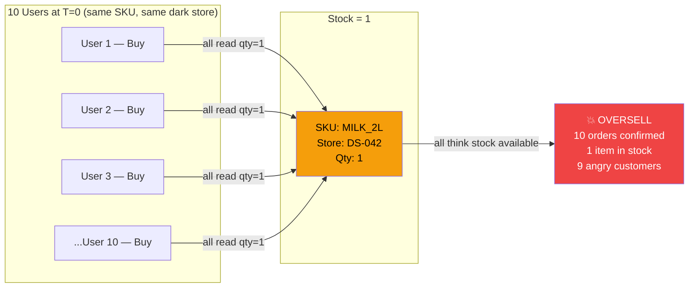

### Why This Is Worse Than It Sounds

```
Scale of the problem (Tesco / Swiggy Instamart / Zepto / Blinkit):
  Dark stores:          5,000+ locations
  SKUs per store:       8,000–15,000
  Mutations per second: 500k+ (picks, receipts, damage, returns, holds)
  Reads per second:     10M+ (product pages, search, availability checks)
  Read:write ratio:     20:1 — reads dominate but writes corrupt

Consequences of overselling:
  Customer orders confirmed → picker finds empty shelf
  Order cancelled last-mile → NPS destruction
  Refund processing costs
  Regulatory issues for age-restricted items
  In grocery: substitution cost or SLA breach

Consequences of under-selling (being too conservative):
  Ghost stock shown as unavailable
  Lost revenue on items that physically exist
  Picker trips to shelves that have stock = wasted labour
```

---

## 2. Dark Store Architecture

A **dark store** (also called micro-fulfillment centre or MFC) is a small warehouse, closed to the public, optimised for rapid order picking. Quick-commerce players (Blinkit, Zepto, Swiggy Instamart) and Tesco's rapid delivery operate hundreds to thousands of these.

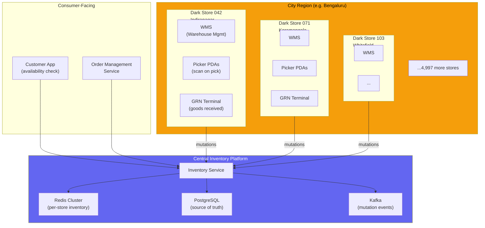

### Inventory Mutation Sources

```
Every second, inventory is mutated by:

SOURCE              DIRECTION   VOLUME      LATENCY REQ
─────────────────────────────────────────────────────────
Customer cart add   Soft hold   Very high   < 50ms
Customer checkout   Hard deduct High        < 100ms
Order pick (PDA)    Hard deduct High        < 200ms
GRN receipt         Increment   Medium      < 1s
Item damage         Decrement   Low         < 5s
Stock take adjust   Set         Low         < 30s
Return to shelf     Increment   Medium      < 1s
Inter-store xfer    Dec + Inc   Low         < 5s
Expiry write-off    Decrement   Low         < 5s
Flash sale launch   Read spike  Extreme     < 10ms
```

---

## 3. Clarifying Requirements

```
1. CONSISTENCY MODEL?
   → For checkout (hard deduct): STRONG consistency — never oversell
   → For browsing (availability display): EVENTUAL — slight staleness OK
   → For cart hold: STRONG within TTL window

2. SCALE?
   → How many dark stores? (e.g. 5,000)
   → Mutations per second? (e.g. 500k across all stores)
   → Peak multiplier? (flash sales: 50× normal)

3. LATENCY?
   → Availability check (read): p99 < 10ms
   → Checkout deduct (write): p99 < 100ms
   → Cart hold (reserve): p99 < 50ms
   → Cache invalidation after mutation: < 1ms

4. ACCURACY TARGET?
   → Oversell rate: 0 (zero tolerance for confirmed-then-cancelled)
   → Ghost stock rate: < 0.1% (items shown OOS that exist)
   → Cache staleness: < 500ms for display, 0ms for checkout

5. STORE TOPOLOGY?
   → Each dark store is a distinct inventory unit
   → No sharing between stores (customer orders from nearest store)
   → Store-level isolation for mutations

6. WHAT IS "INVENTORY"?
   → Physical quantity on shelf
   → Sellable quantity = physical - reserved - damaged - picked
   → Available quantity = sellable - safety buffer
```

### Our Problem Statement

| Parameter | Value |
|-----------|-------|
| Dark stores | 5,000 |
| SKUs per store | 10,000 |
| Total inventory records | 50M |
| Mutation throughput | 500k/sec peak |
| Read throughput | 10M/sec |
| Checkout latency SLA | p99 < 100ms |
| Cache invalidation SLA | < 1ms |
| Oversell tolerance | Zero |
| Ghost stock tolerance | < 0.1% |

---

## 4. High-Level Architecture

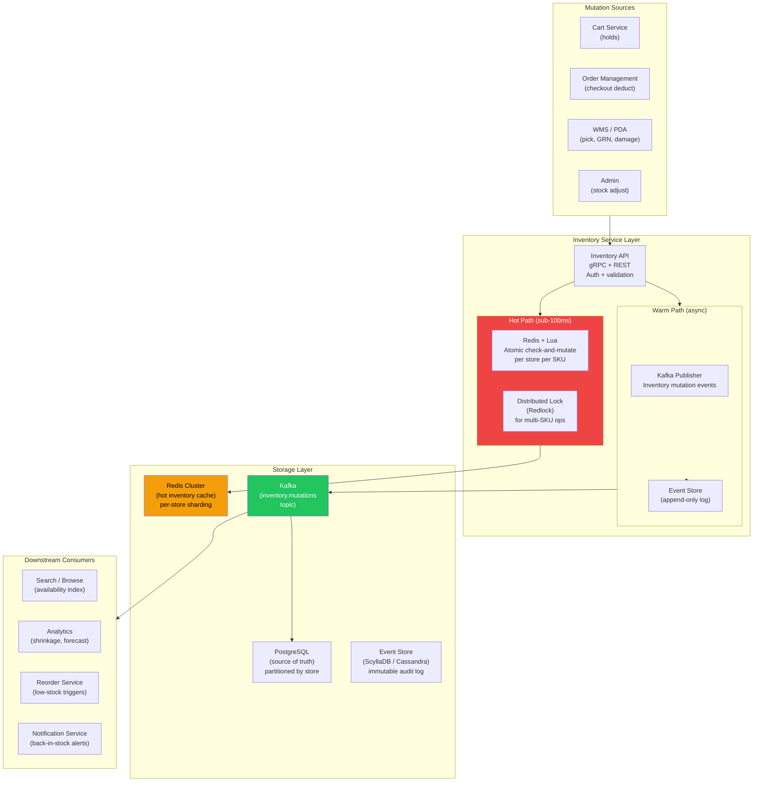

---

## 5. Inventory State Model

### The Layered Quantity Model

```
PHYSICAL_QTY
  Total items known to exist in the store
  Source: WMS, last stock-take

  ↓ minus

DAMAGED_QTY
  Items physically present but unsellable
  Source: damage scans on PDA

  ↓ equals

SELLABLE_QTY = PHYSICAL_QTY - DAMAGED_QTY

  ↓ minus

RESERVED_QTY
  Items held in active carts (soft holds)
  TTL-based: hold expires if cart abandoned

PICKED_QTY
  Items currently being picked for active orders
  Released if pick fails (item not found on shelf)

  ↓ equals

AVAILABLE_QTY = SELLABLE_QTY - RESERVED_QTY - PICKED_QTY

  ↓ minus

SAFETY_BUFFER
  Configurable minimum (e.g. 1 unit)
  Prevents showing 1 unit available across many concurrent sessions

  ↓ equals

DISPLAYABLE_QTY = max(0, AVAILABLE_QTY - SAFETY_BUFFER)
```

### Redis Data Structure Per SKU Per Store

```python
# Key schema: inv:{store_id}:{sku_id}
# Value: Redis Hash

# Example: inv:DS042:MILK_2L_AMUL
{
    "physical":   "24",   # physical count
    "damaged":    "1",    # damaged units
    "reserved":   "3",    # held in carts
    "picked":     "2",    # being picked
    "version":    "1847", # optimistic lock version
    "updated_at": "1710500042123",  # epoch ms
    "safety_buf": "1",
}

# Derived at read time (not stored to avoid inconsistency):
# sellable   = physical - damaged                 = 23
# available  = sellable - reserved - picked       = 18
# displayable = max(0, available - safety_buf)    = 17
```

### Database Schema

```sql
-- Source of truth — partitioned by store_id
CREATE TABLE inventory (
    store_id        VARCHAR(20) NOT NULL,
    sku_id          VARCHAR(50) NOT NULL,
    physical_qty    INT NOT NULL DEFAULT 0,
    damaged_qty     INT NOT NULL DEFAULT 0,
    reserved_qty    INT NOT NULL DEFAULT 0,
    picked_qty      INT NOT NULL DEFAULT 0,
    safety_buffer   INT NOT NULL DEFAULT 1,
    version         BIGINT NOT NULL DEFAULT 0,  -- optimistic lock
    last_mutated_at TIMESTAMPTZ DEFAULT NOW(),
    PRIMARY KEY (store_id, sku_id)
) PARTITION BY HASH (store_id);

-- Reservation table — TTL-managed holds
CREATE TABLE inventory_reservations (
    reservation_id  UUID PRIMARY KEY,
    store_id        VARCHAR(20) NOT NULL,
    sku_id          VARCHAR(50) NOT NULL,
    user_id         UUID NOT NULL,
    order_id        UUID,
    qty             INT NOT NULL,
    status          VARCHAR(20) DEFAULT 'ACTIVE',  -- ACTIVE, CONFIRMED, RELEASED
    expires_at      TIMESTAMPTZ NOT NULL,
    created_at      TIMESTAMPTZ DEFAULT NOW(),
    INDEX idx_expiry (expires_at) WHERE status = 'ACTIVE',
    INDEX idx_store_sku (store_id, sku_id)
);

-- Append-only mutation log
CREATE TABLE inventory_events (
    event_id        UUID DEFAULT gen_random_uuid(),
    store_id        VARCHAR(20) NOT NULL,
    sku_id          VARCHAR(50) NOT NULL,
    event_type      VARCHAR(30) NOT NULL,  -- CART_HOLD, CHECKOUT, PICK, GRN, DAMAGE, ADJUST
    delta           INT NOT NULL,          -- positive = increase, negative = decrease
    qty_after       INT NOT NULL,          -- qty after mutation (for audit)
    reference_id    VARCHAR(100),          -- order_id, po_id, etc.
    actor_id        VARCHAR(100),          -- user, system, picker_id
    occurred_at     TIMESTAMPTZ DEFAULT NOW(),
    PRIMARY KEY (store_id, occurred_at, event_id)
) PARTITION BY RANGE (occurred_at);
```

---

## 6. The Overselling Problem — Root Cause

### Race Condition Anatomy

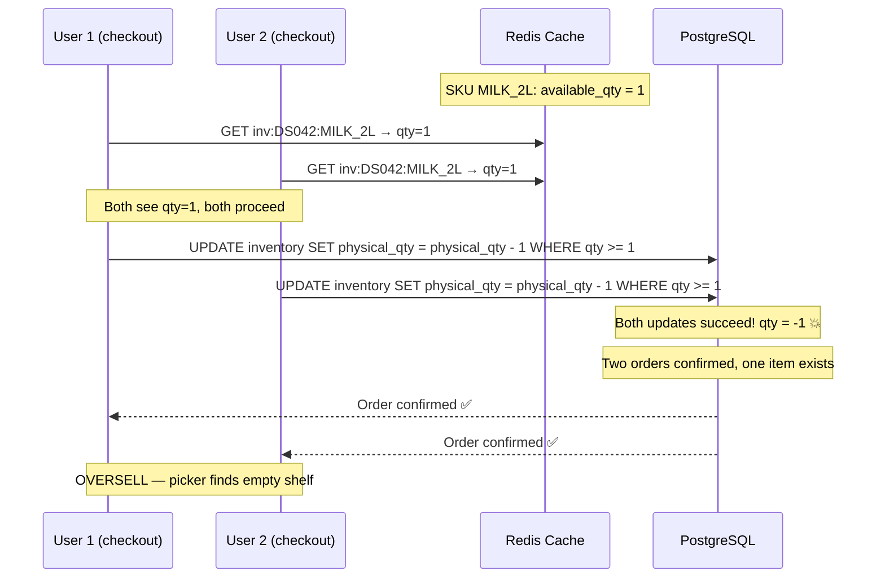

### Why a Simple DB Check Isn't Enough

```
Naive fix: SELECT qty → check > 0 → UPDATE qty = qty - 1
Problem: SELECT and UPDATE are separate operations
         Another transaction can slip in between

Better: UPDATE inventory SET qty = qty - 1 WHERE qty > 0 → check affected_rows
Works for single-node DB but:
  1. At 500k mutations/sec: DB becomes bottleneck
  2. Read latency 20–50ms: too slow for availability checks
  3. Connection pool exhaustion under flash sale load
  4. Cross-service distributed transactions are expensive
```

---

## 7. Atomic Decrement — Redis Lua Scripts

Redis executes Lua scripts atomically — the entire script runs as a single operation. No other Redis command can interleave. This is the core of oversell prevention.

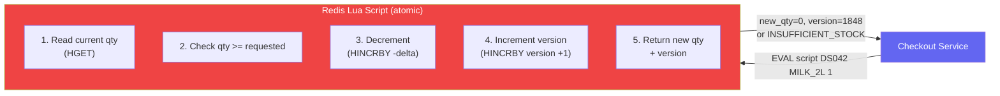

### The Core Lua Scripts

```lua
-- ─────────────────────────────────────────────────────────────────
-- Script 1: CHECKOUT_DEDUCT
-- Atomically deduct from available inventory (checkout path)
-- KEYS[1] = inv:{store_id}:{sku_id}
-- ARGV[1] = qty to deduct
-- ARGV[2] = reservation_id (if converting a hold)
-- Returns: {new_available, version} or error string
-- ─────────────────────────────────────────────────────────────────
local key = KEYS[1]
local qty_requested = tonumber(ARGV[1])
local reservation_id = ARGV[2]

-- Read all fields atomically
local data = redis.call('HMGET', key,
    'physical', 'damaged', 'reserved', 'picked', 'safety_buf', 'version')

local physical   = tonumber(data[1]) or 0
local damaged    = tonumber(data[2]) or 0
local reserved   = tonumber(data[3]) or 0
local picked     = tonumber(data[4]) or 0
local safety_buf = tonumber(data[5]) or 1
local version    = tonumber(data[6]) or 0

-- Compute available
local sellable   = physical - damaged
local available  = sellable - reserved - picked
local displayable = math.max(0, available - safety_buf)

-- Guard: insufficient stock
if displayable < qty_requested then
    return redis.error_reply('INSUFFICIENT_STOCK:' .. displayable)
end

-- Atomic deduct: move from available to picked
redis.call('HINCRBY', key, 'picked', qty_requested)
local new_version = redis.call('HINCRBY', key, 'version', 1)
redis.call('HSET', key, 'updated_at', redis.call('TIME')[1] * 1000)

-- Return new available qty and version for downstream
local new_available = displayable - qty_requested
return {new_available, new_version}
```

```lua
-- ─────────────────────────────────────────────────────────────────
-- Script 2: CART_HOLD
-- Soft reserve — atomically move qty into reserved bucket
-- Fails fast if insufficient displayable stock
-- ─────────────────────────────────────────────────────────────────
local key = KEYS[1]
local qty   = tonumber(ARGV[1])
local ttl_s = tonumber(ARGV[2])  -- reservation TTL in seconds

local data = redis.call('HMGET', key,
    'physical', 'damaged', 'reserved', 'picked', 'safety_buf')

local physical   = tonumber(data[1]) or 0
local damaged    = tonumber(data[2]) or 0
local reserved   = tonumber(data[3]) or 0
local picked     = tonumber(data[4]) or 0
local safety_buf = tonumber(data[5]) or 1

local available  = (physical - damaged) - reserved - picked
local displayable = math.max(0, available - safety_buf)

if displayable < qty then
    return redis.error_reply('INSUFFICIENT_STOCK:' .. displayable)
end

-- Atomically increment reserved
redis.call('HINCRBY', key, 'reserved', qty)
local version = redis.call('HINCRBY', key, 'version', 1)

-- Track reservation expiry key (TTL for auto-release)
local hold_key = 'hold:' .. KEYS[2]  -- hold:{reservation_id}
redis.call('SET', hold_key, key .. ':' .. qty)
redis.call('EXPIRE', hold_key, ttl_s)

return {displayable - qty, version}
```

```lua
-- ─────────────────────────────────────────────────────────────────
-- Script 3: RELEASE_HOLD
-- Release a cart hold — atomically decrement reserved
-- Called when cart expires, order cancelled, or checkout converts hold
-- ─────────────────────────────────────────────────────────────────
local key         = KEYS[1]
local hold_key    = KEYS[2]
local qty         = tonumber(ARGV[1])

-- Confirm hold still exists (TTL not already expired + released)
local hold_data = redis.call('GET', hold_key)
if not hold_data then
    return redis.error_reply('HOLD_EXPIRED_OR_NOT_FOUND')
end

-- Release the reservation
redis.call('HINCRBY', key, 'reserved', -qty)
redis.call('HINCRBY', key, 'version', 1)
redis.call('DEL', hold_key)

return redis.call('HGET', key, 'version')
```

### Python Integration

```python
import redis
import hashlib

class InventoryRedisClient:
    CHECKOUT_DEDUCT_SCRIPT = open("scripts/checkout_deduct.lua").read()
    CART_HOLD_SCRIPT       = open("scripts/cart_hold.lua").read()
    RELEASE_HOLD_SCRIPT    = open("scripts/release_hold.lua").read()

    def __init__(self, redis_cluster: redis.RedisCluster):
        self.redis = redis_cluster
        # Register scripts — returns SHA for EVALSHA (faster than EVAL)
        self._checkout_sha = self.redis.script_load(self.CHECKOUT_DEDUCT_SCRIPT)
        self._hold_sha     = self.redis.script_load(self.CART_HOLD_SCRIPT)
        self._release_sha  = self.redis.script_load(self.RELEASE_HOLD_SCRIPT)

    def checkout_deduct(self, store_id: str, sku_id: str, qty: int) -> dict:
        key = f"inv:{store_id}:{sku_id}"
        try:
            new_qty, version = self.redis.evalsha(
                self._checkout_sha, 1, key, qty, ""
            )
            return {"status": "OK", "new_qty": new_qty, "version": version}
        except redis.ResponseError as e:
            if "INSUFFICIENT_STOCK" in str(e):
                available = int(str(e).split(":")[1])
                return {"status": "INSUFFICIENT_STOCK", "available": available}
            raise

    def cart_hold(self, store_id: str, sku_id: str,
                  qty: int, reservation_id: str, ttl_seconds: int = 600) -> dict:
        inv_key  = f"inv:{store_id}:{sku_id}"
        hold_key = f"hold:{reservation_id}"
        try:
            new_qty, version = self.redis.evalsha(
                self._hold_sha, 2, inv_key, hold_key, qty, ttl_seconds
            )
            return {"status": "OK", "new_qty": new_qty, "version": version}
        except redis.ResponseError as e:
            if "INSUFFICIENT_STOCK" in str(e):
                return {"status": "INSUFFICIENT_STOCK"}
            raise
```

---

## 8. Distributed Locking — Redlock

For operations spanning **multiple SKUs** (e.g. combo deals, bundle checkout), a single Lua script per key isn't sufficient. We need a distributed lock.

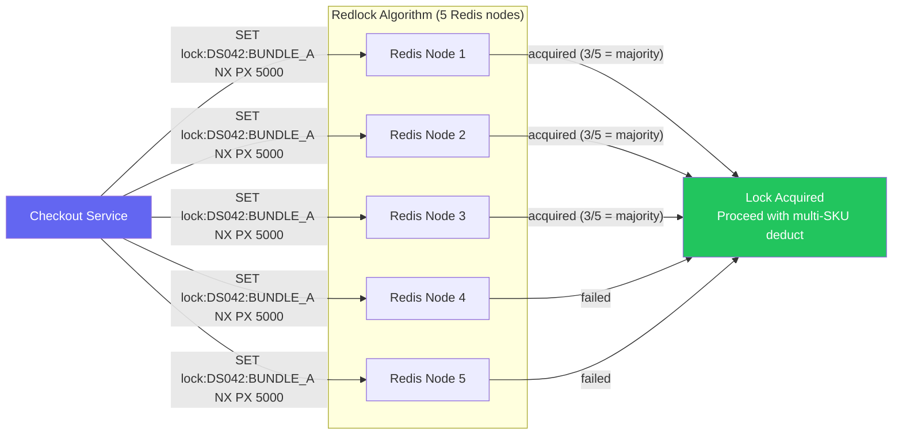

```python
import time
import uuid
from redis import Redis

class Redlock:
    """
    Distributed lock across N Redis nodes.
    Requires majority (N/2 + 1) to acquire.
    """
    LOCK_SCRIPT = """
        if redis.call('GET', KEYS[1]) == ARGV[1] then
            return redis.call('DEL', KEYS[1])
        else
            return 0
        end
    """

    def __init__(self, redis_nodes: list[Redis], retry_count=3, retry_delay_ms=200):
        self.nodes = redis_nodes
        self.quorum = len(redis_nodes) // 2 + 1
        self.retry_count = retry_count
        self.retry_delay = retry_delay_ms / 1000

    def acquire(self, resource: str, ttl_ms: int) -> tuple[bool, str]:
        token = str(uuid.uuid4())

        for attempt in range(self.retry_count):
            acquired = 0
            start_ms = time.time() * 1000

            for node in self.nodes:
                try:
                    if node.set(resource, token, nx=True, px=ttl_ms):
                        acquired += 1
                except Exception:
                    pass  # node unavailable — skip

            elapsed_ms = time.time() * 1000 - start_ms
            validity_ms = ttl_ms - elapsed_ms - self._drift(ttl_ms)

            if acquired >= self.quorum and validity_ms > 0:
                return True, token   # lock acquired

            # Failed — release partial locks
            self.release(resource, token)
            time.sleep(self.retry_delay + random.uniform(0, self.retry_delay))

        return False, ""

    def release(self, resource: str, token: str):
        for node in self.nodes:
            try:
                node.eval(self.LOCK_SCRIPT, 1, resource, token)
            except Exception:
                pass

    def _drift(self, ttl_ms: int) -> float:
        return ttl_ms * 0.01 + 2  # 1% drift + 2ms clock skew

# Usage: Bundle checkout (MILK_2L + BREAD_WW)
def checkout_bundle(store_id, bundle_skus, qtys):
    lock_key = f"lock:{store_id}:bundle:{':'.join(sorted(bundle_skus))}"
    acquired, token = redlock.acquire(lock_key, ttl_ms=5000)

    if not acquired:
        raise LockAcquisitionError("Could not acquire bundle lock — try again")

    try:
        # All-or-nothing: check and deduct all SKUs atomically
        results = []
        for sku, qty in zip(bundle_skus, qtys):
            result = inv_client.checkout_deduct(store_id, sku, qty)
            if result["status"] != "OK":
                # Rollback all previous deductions
                for r_sku, r_qty, r_ver in results:
                    inv_client.rollback_deduct(store_id, r_sku, r_qty, r_ver)
                raise InsufficientStockError(f"{sku} out of stock")
            results.append((sku, qty, result["version"]))
    finally:
        redlock.release(lock_key, token)
```

---

## 9. Reservation Pattern — Soft Hold Lifecycle

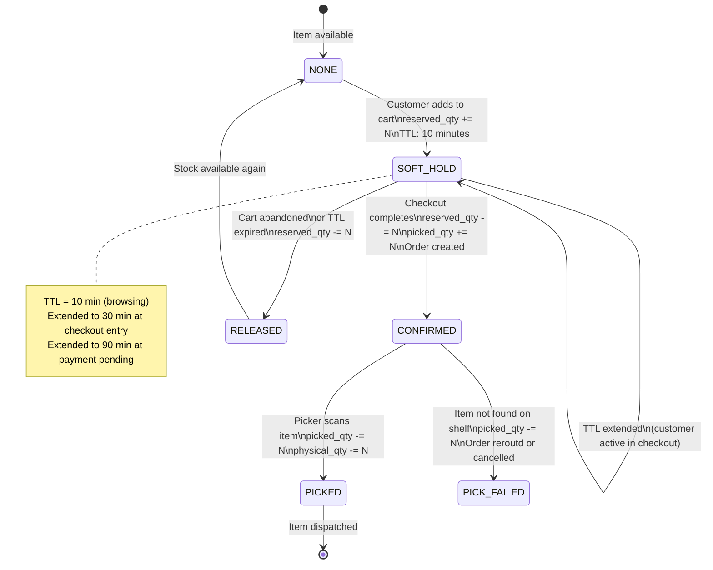

### Hold Expiry — The Ghost Reservation Problem

```
If hold TTL expires and we don't clean up reserved_qty,
stock appears lower than reality → ghost stock → lost sales

Solutions:

1. Redis key expiry with keyspace notifications:
   Subscribe to __keyevent@0__:expired
   On hold:* key expiry → decrement reserved_qty

2. Scheduled sweeper (belt-and-suspenders):
   Every 60s: find reservations past TTL → release reserved_qty
   Handles edge cases where keyspace notification missed

3. Lazy release on read:
   When computing available_qty: check if active holds are expired
   If expired: release + recompute
   Downside: needs DB lookup in hot path
```

```python
# Redis keyspace notification handler
import redis

def setup_expiry_listener():
    pubsub = redis_client.pubsub()
    pubsub.psubscribe("__keyevent@0__:expired")

    for message in pubsub.listen():
        if message["type"] != "pmessage":
            continue

        expired_key = message["data"]

        # hold:{reservation_id} key expired
        if expired_key.startswith("hold:"):
            reservation_id = expired_key.split(":", 1)[1]
            asyncio.create_task(release_expired_hold(reservation_id))

async def release_expired_hold(reservation_id: str):
    """Release reserved qty when cart TTL expires."""
    reservation = await db.get_reservation(reservation_id)

    if not reservation or reservation.status != "ACTIVE":
        return  # already released or confirmed

    inv_key  = f"inv:{reservation.store_id}:{reservation.sku_id}"
    hold_key = f"hold:{reservation_id}"

    # Attempt Redis release (key already gone — just fix the hash)
    await redis_client.evalsha(
        release_sha, 2, inv_key, hold_key,
        reservation.qty
    )

    await db.update_reservation(reservation_id, status="RELEASED")
    await publish_inventory_event("HOLD_RELEASED", reservation)
```

---

## 10. Cache Invalidation at Sub-Millisecond Scale

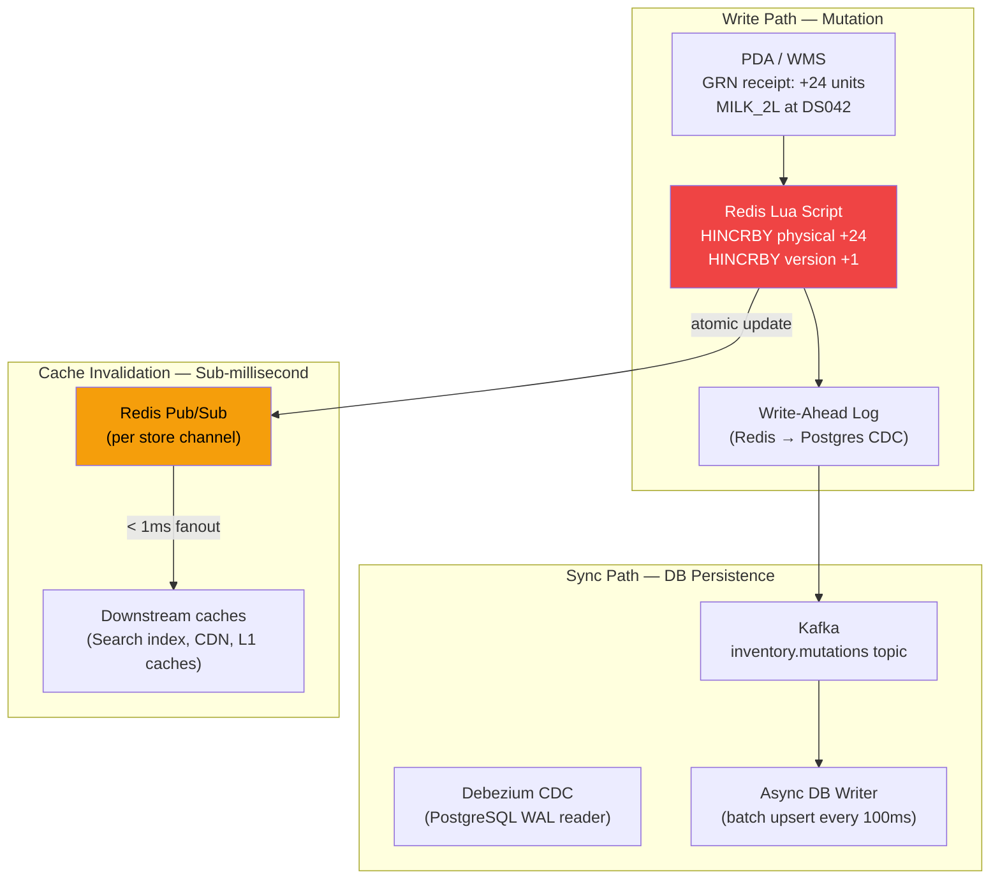

### Write Path — Mutation to Cache in Under 1ms

```python
class InventoryMutationService:
    """
    All mutations go through this service.
    Redis is the write-first cache — DB is async follower.
    """
    async def apply_mutation(self, mutation: InventoryMutation) -> MutationResult:
        inv_key = f"inv:{mutation.store_id}:{mutation.sku_id}"

        # Step 1: Apply atomically to Redis (< 1ms)
        new_qty, version = await self._apply_lua(mutation)

        # Step 2: Publish invalidation event (< 0.5ms — fire and forget)
        asyncio.create_task(
            self._publish_invalidation(mutation.store_id, mutation.sku_id, new_qty, version)
        )

        # Step 3: Async DB write via Kafka (non-blocking)
        asyncio.create_task(
            self._publish_to_kafka(mutation, new_qty, version)
        )

        return MutationResult(status="OK", new_qty=new_qty, version=version)

    async def _publish_invalidation(self, store_id, sku_id, new_qty, version):
        """
        Fan out to all systems that cache this inventory state.
        Uses Redis Pub/Sub — sub-millisecond delivery to subscribers.
        """
        channel = f"inv_updates:{store_id}"
        payload = json.dumps({
            "sku_id": sku_id,
            "new_qty": new_qty,
            "version": version,
            "ts": int(time.time() * 1000)
        })
        await redis_client.publish(channel, payload)
```

### Multi-Layer Cache Hierarchy

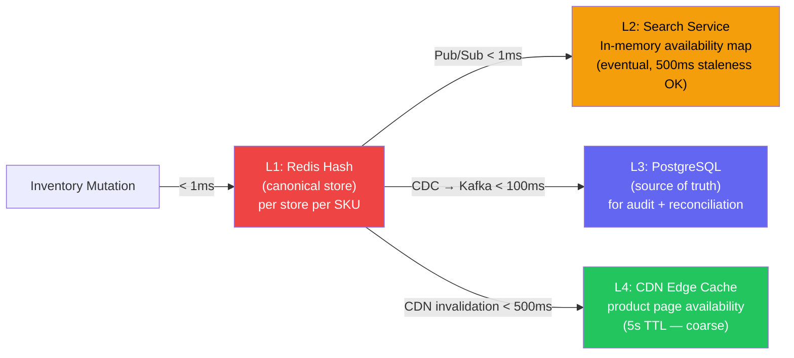

### Version-Based Cache Coherence

```python
class SearchAvailabilityCache:
    """
    L2 cache — serves availability to browse/search.
    Subscribes to Redis Pub/Sub for sub-millisecond invalidations.
    """
    def __init__(self):
        self.local_cache: dict[str, dict] = {}   # sku → {qty, version, ts}

    async def listen_for_updates(self, store_id: str):
        pubsub = redis_client.pubsub()
        await pubsub.subscribe(f"inv_updates:{store_id}")

        async for message in pubsub.listen():
            if message["type"] != "message":
                continue

            update = json.loads(message["data"])
            key = f"{store_id}:{update['sku_id']}"
            cached = self.local_cache.get(key, {})

            # Only update if newer version (handles out-of-order messages)
            if update["version"] > cached.get("version", -1):
                self.local_cache[key] = {
                    "qty":     update["new_qty"],
                    "version": update["version"],
                    "ts":      update["ts"]
                }

    def get_availability(self, store_id: str, sku_id: str) -> int:
        entry = self.local_cache.get(f"{store_id}:{sku_id}")
        if entry:
            return entry["qty"]
        return -1  # unknown — fallback to Redis
```

---

## 11. Event Sourcing for Inventory

Instead of storing current state (mutable), store every mutation as an immutable event. Current state = replay of all events.

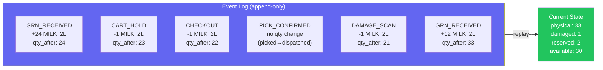

### Benefits of Event Sourcing for Inventory

```
1. COMPLETE AUDIT TRAIL
   Every movement traceable to actor + timestamp + reference
   "Who touched this SKU?" → query event log
   Essential for shrinkage investigation, stock discrepancy resolution

2. TIME TRAVEL
   Replay events up to any point in time
   "What was the inventory of MILK_2L at DS042 at 14:32 yesterday?"
   Critical for reconciliation after system outage

3. CAUSAL ORDERING
   Events have version numbers — detect out-of-order mutations
   Replay in order even if Kafka delivers out-of-order

4. COMPENSATION
   Wrong mutation? Append a compensating event (don't update in place)
   "Stock count was wrong — adjust +5" → STOCK_ADJUSTMENT event
   No silent data corruption

5. PROJECTIONS
   Materialise any view from the event stream
   Analytics: shrinkage rate, pick accuracy, GRN variance
   No separate reporting DB needed
```

### ScyllaDB / Cassandra Event Store

```python
# Cassandra table for immutable event log
CREATE TABLE inventory_events (
    store_id    TEXT,
    sku_id      TEXT,
    version     BIGINT,
    event_type  TEXT,
    delta       INT,
    qty_after   INT,
    reference_id TEXT,
    actor_id    TEXT,
    occurred_at TIMESTAMP,
    PRIMARY KEY ((store_id, sku_id), version)
) WITH CLUSTERING ORDER BY (version ASC)
  AND default_time_to_live = 7776000;  -- 90 days retention

# Write (append-only, lightweight transaction for version ordering)
INSERT INTO inventory_events
    (store_id, sku_id, version, event_type, delta, qty_after, ...)
VALUES (?, ?, ?, ?, ?, ?, ...)
IF NOT EXISTS;  -- lightweight transaction prevents version collision

# Read (full history)
SELECT * FROM inventory_events
WHERE store_id = 'DS042' AND sku_id = 'MILK_2L'
ORDER BY version ASC;

# Read (since a version — for incremental sync)
SELECT * FROM inventory_events
WHERE store_id = 'DS042' AND sku_id = 'MILK_2L'
  AND version > 1840;
```

---

## 12. Flash Sale Handling

Flash sales create extreme traffic spikes — 50–100× normal load in seconds. The inventory system must not become the bottleneck.

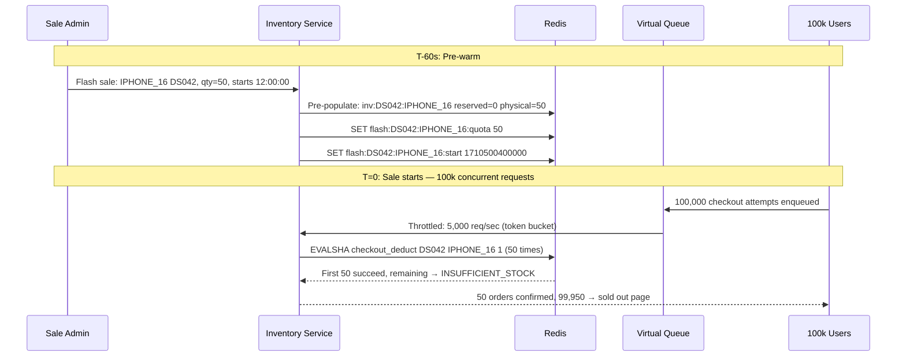

### Flash Sale Token Bucket (Pre-sale Quota)

```python
FLASH_SALE_SCRIPT = """
-- Flash sale atomic deduct with quota enforcement
-- KEYS[1] = inv:{store_id}:{sku_id}
-- KEYS[2] = flash:{store_id}:{sku_id}:quota
-- ARGV[1] = qty requested
-- ARGV[2] = user_id (for per-user limit)
-- ARGV[3] = max_per_user

local inv_key   = KEYS[1]
local quota_key = KEYS[2]
local qty       = tonumber(ARGV[1])
local user_id   = ARGV[2]
local max_user  = tonumber(ARGV[3])

-- Check sale quota remaining
local quota = tonumber(redis.call('GET', quota_key) or '0')
if quota < qty then
    return redis.error_reply('QUOTA_EXHAUSTED')
end

-- Per-user limit check
local user_key = 'flash_user:' .. user_id .. ':' .. KEYS[2]
local user_count = tonumber(redis.call('GET', user_key) or '0')
if user_count + qty > max_user then
    return redis.error_reply('USER_LIMIT_EXCEEDED')
end

-- Deduct from inventory
local data = redis.call('HMGET', inv_key, 'physical', 'damaged', 'reserved', 'picked')
local physical = tonumber(data[1]) or 0
local available = physical - (tonumber(data[2]) or 0)
                            - (tonumber(data[3]) or 0)
                            - (tonumber(data[4]) or 0)

if available < qty then
    return redis.error_reply('INSUFFICIENT_STOCK')
end

-- Commit all atomically
redis.call('DECRBY', quota_key, qty)
redis.call('HINCRBY', inv_key, 'picked', qty)
redis.call('HINCRBY', inv_key, 'version', 1)
redis.call('INCRBY', user_key, qty)
redis.call('EXPIRE', user_key, 86400)

return {quota - qty, available - qty}
"""

class FlashSaleService:
    def reserve_flash_item(self, store_id: str, sku_id: str,
                           user_id: str, qty: int = 1) -> dict:
        inv_key   = f"inv:{store_id}:{sku_id}"
        quota_key = f"flash:{store_id}:{sku_id}:quota"
        try:
            remaining_quota, new_qty = self.redis.eval(
                FLASH_SALE_SCRIPT, 2, inv_key, quota_key,
                qty, user_id, MAX_PER_USER
            )
            return {"status": "OK", "remaining": new_qty}
        except redis.ResponseError as e:
            return {"status": str(e).split(":")[0]}
```

### Virtual Queue for Flash Sales

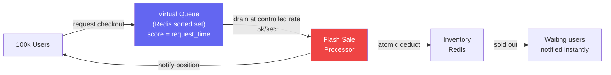

---

## 13. CRDT Counters for Eventually Consistent Stores

For stores with intermittent connectivity (network partition between dark store and central), use CRDTs to allow local mutations that merge correctly when connectivity resumes.

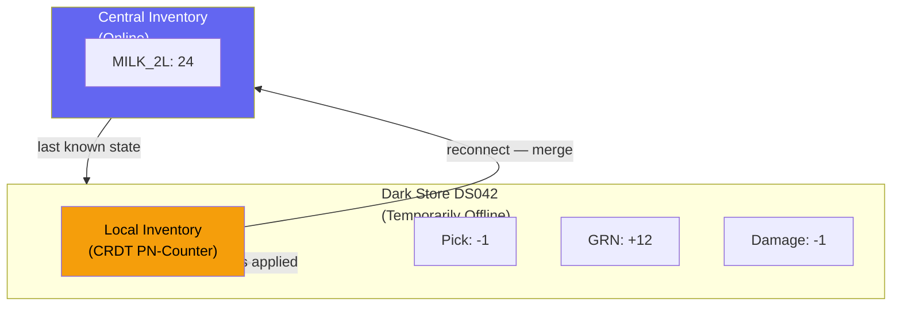

### PN-Counter CRDT

```python
class PNCounter:
    """
    Positive-Negative Counter CRDT.
    Supports increment and decrement with eventual consistency.
    Each node has its own P (increment) and N (decrement) vectors.
    Merge: take max of each component.
    """
    def __init__(self, node_id: str):
        self.node_id = node_id
        self.p: dict[str, int] = {node_id: 0}  # increments
        self.n: dict[str, int] = {node_id: 0}  # decrements

    def increment(self, delta: int = 1):
        self.p[self.node_id] = self.p.get(self.node_id, 0) + delta

    def decrement(self, delta: int = 1):
        self.n[self.node_id] = self.n.get(self.node_id, 0) + delta

    def value(self) -> int:
        return sum(self.p.values()) - sum(self.n.values())

    def merge(self, other: "PNCounter"):
        """
        Merge another node's state.
        Idempotent, commutative, associative — safe to apply multiple times.
        """
        for node, count in other.p.items():
            self.p[node] = max(self.p.get(node, 0), count)
        for node, count in other.n.items():
            self.n[node] = max(self.n.get(node, 0), count)

    def to_dict(self) -> dict:
        return {"p": self.p, "n": self.n}

# Merge on reconnect:
central_counter.merge(store_counter)
print(central_counter.value())  # correctly reflects all local mutations
```

> **When to use CRDT vs strong consistency:**
> CRDT is suitable for display-only quantities when brief over-counting is acceptable. For checkout, always use the strong-consistent Redis Lua path — CRDTs cannot prevent overselling.

---

## 14. Failure Modes & Resilience

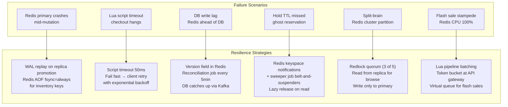

### Reconciliation — Redis vs DB Drift

```python
class InventoryReconciler:
    """
    Runs every 5 minutes per store.
    Detects drift between Redis cache and PostgreSQL source of truth.
    Corrects Redis without taking write lock.
    """
    async def reconcile_store(self, store_id: str):
        # Fetch DB ground truth for all SKUs in this store
        db_inventory = await self.db.fetch_all_inventory(store_id)

        drift_detected = []

        for record in db_inventory:
            redis_key = f"inv:{store_id}:{record.sku_id}"
            redis_data = await self.redis.hgetall(redis_key)

            if not redis_data:
                # Redis key missing — backfill from DB
                await self._backfill_from_db(redis_key, record)
                drift_detected.append(record.sku_id)
                continue

            db_version = record.version
            redis_version = int(redis_data.get("version", 0))

            if redis_version < db_version:
                # Redis is stale — DB has newer state
                await self._overwrite_from_db(redis_key, record)
                drift_detected.append(record.sku_id)

        if drift_detected:
            await self.metrics.record_drift(store_id, len(drift_detected))
            await self.alert_if_threshold(store_id, drift_detected)
```

---

## 15. Observability — Inventory Accuracy

### Key Metrics

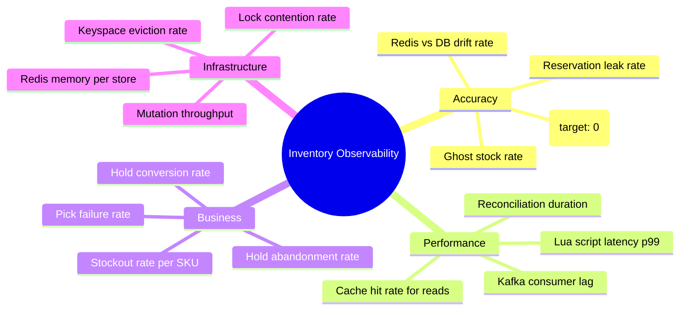

### Prometheus Metrics

```python
from prometheus_client import Counter, Histogram, Gauge

# Core accuracy metric — should be 0 always
oversell_count = Counter(
    "inventory_oversell_total",
    "Times inventory went negative after confirmed order",
    ["store_id", "sku_id"]
)

# Lua script performance
lua_latency = Histogram(
    "inventory_lua_duration_seconds",
    "Redis Lua script execution time",
    ["operation"],   # checkout_deduct, cart_hold, release_hold
    buckets=[0.0001, 0.0005, 0.001, 0.005, 0.01, 0.05]
)

# Cache coherence
redis_db_drift = Gauge(
    "inventory_redis_db_drift_count",
    "SKUs where Redis qty differs from DB qty",
    ["store_id"]
)

# Hold health
active_holds = Gauge(
    "inventory_active_holds",
    "Current active cart reservations",
    ["store_id"]
)

leaked_holds = Counter(
    "inventory_leaked_holds_total",
    "Reservations not released within 2x TTL",
    ["store_id"]
)
```

### Alert Rules

```yaml
groups:
  - name: inventory
    rules:

      - alert: InventoryOversell
        expr: increase(inventory_oversell_total[5m]) > 0
        for: 0m
        severity: critical
        annotations:
          summary: "OVERSELL DETECTED — immediate investigation required"
          runbook: "https://wiki/inventory-oversell-runbook"

      - alert: LuaScriptLatencyHigh
        expr: |
          histogram_quantile(0.99,
            rate(inventory_lua_duration_seconds_bucket
              {operation="checkout_deduct"}[5m])
          ) > 0.010
        for: 2m
        severity: warning
        summary: "Checkout deduct p99 > 10ms — Redis under pressure"

      - alert: HighInventoryDrift
        expr: inventory_redis_db_drift_count > 1000
        for: 10m
        severity: warning
        summary: "More than 1000 SKUs drifted between Redis and DB"

      - alert: HoldLeakDetected
        expr: rate(inventory_leaked_holds_total[5m]) > 10
        for: 5m
        severity: warning
        summary: "Cart holds leaking — reserved_qty may be inflated"
```

---

## 16. Interview Cheat Sheet

### The Golden Mental Model

```
Inventory = shared mutable counter — hardest class of distributed systems problem

Core principle:
  READ path:  eventually consistent (Redis cache, 500ms staleness OK for browse)
  WRITE path: strongly consistent (Redis Lua atomic ops, NEVER go negative)

Oversell prevention stack:
  Layer 1 → Redis Lua atomic check-and-decrement (< 1ms, single SKU)
  Layer 2 → Redlock for multi-SKU bundles (< 5ms, distributed)
  Layer 3 → Reservation TTL sweep (belt-and-suspenders for leaked holds)
  Layer 4 → DB CHECK constraint (last resort: qty >= 0)

Cache invalidation:
  Redis is the write-first store → DB is async follower via Kafka CDC
  Sub-millisecond invalidation via Redis Pub/Sub to downstream caches
  Version numbers detect out-of-order invalidation messages
```

### Flow in 6 Steps (Checkout)

```
1. HOLD      Cart add → Redis Lua CART_HOLD → reserved_qty += N (TTL 10min)
2. CHECK     Checkout → Redis Lua CHECKOUT_DEDUCT → atomic qty check + deduct
3. CONFIRM   Order created → reserved_qty -= N, picked_qty += N
4. PICK      Picker scans item → physical_qty -= N, picked_qty -= N
5. PUBLISH   All mutations → Kafka → async DB write + downstream invalidation
6. RECONCILE Every 5min → compare Redis vs DB → fix drift
```

### Common Interview Questions

| Question | Key Answer |
|----------|-----------|
| How do you prevent overselling? | Redis Lua script: atomic read-check-decrement. Single-threaded execution — no race condition possible |
| Why Redis over DB for inventory? | DB: 20–50ms, 10k TPS limit. Redis Lua: < 1ms, 100k+ TPS. Oversell prevention needs sub-ms atomicity |
| What is the reservation pattern? | Soft hold (cart) → Hard deduct (checkout) → Physical deduct (pick). Each with TTL and release path |
| What is Redlock? | Distributed lock across 5 Redis nodes. Requires 3/5 majority. Used for multi-SKU atomic ops |
| How do you handle hold expiry? | Redis keyspace expiry notifications + sweeper job. Release reserved_qty on TTL expiry |
| Redis vs DB consistency? | Redis is write-first. DB follows async via Kafka CDC. Reconcile every 5min. DB is audit truth |
| What is event sourcing here? | Every mutation = immutable event in append-only log. Current state = event replay. Enables audit + time-travel |
| How do you handle flash sales? | Virtual queue + token bucket at API gateway. Pre-warm Redis. Flash sale Lua with per-user quota |
| What is CRDT for inventory? | PN-Counter: allows offline mutations that merge correctly on reconnect. For display only — not checkout |
| How do you detect oversells? | Monitor inventory going negative in Redis. Alert immediately. Reconcile to find root cause event |
| What happens if Redis crashes? | AOF fsync=always for inventory keys. Replica promoted, WAL replayed. DB is fallback for < 5s window |

### Numbers to Remember

| Metric | Value |
|--------|-------|
| Redis Lua script latency | < 1ms |
| Redlock acquire latency | 2–5ms |
| Cart hold TTL (default) | 10 minutes |
| Cart hold TTL (at payment) | 90 minutes |
| Reconciliation frequency | Every 5 minutes |
| Redis AOF fsync mode | everysec (default) → always for inventory |
| Oversell tolerance | Zero |
| Ghost stock tolerance | < 0.1% |
| Dark stores (example) | 5,000 |
| SKUs per store (example) | 10,000 |
| Total inventory records | 50M |
| Peak mutation throughput | 500k/sec |

---

## 📚 Further Reading

- [Blinkit Engineering — Inventory at Scale](https://blog.blinkit.com) — Real-world dark store inventory design
- [Martin Kleppmann — Designing Data-Intensive Applications](https://dataintensive.net) — Chapter 7 (Transactions), Chapter 11 (Event Sourcing)
- [Redis Documentation — EVAL / Lua Scripting](https://redis.io/docs/manual/programmability/eval-intro/)
- [Redlock Algorithm — antirez](https://redis.io/docs/manual/patterns/distributed-locks/)
- [CRDT — A Comprehensive Study](https://crdt.tech/)
- [Debezium — Change Data Capture](https://debezium.io/documentation/)
- [Uber Engineering — Inventory Management](https://eng.uber.com)
- [Amazon — Inventory Reservation Patterns](https://aws.amazon.com/builders-library/)

---

*Study guide by Manas Ranjan Dash · Part of the [software-design](https://github.com/simplymanas/software-design) series*
*Prev: Notification System | Next: URL Shortener*
