# 🧠 How Large Language Models Work — Complete Design Guide

> **Study Guide** | Author: Manas Ranjan Dash | Level: Senior → Staff Engineer / ML Practitioner
>
> A first-principles deep dive into how Large Language Models are designed, trained, and served — covering Transformer architecture, pre-training pipelines, fine-tuning strategies, inference optimization, and production LLM system design.

---

## 📋 Table of Contents

1. [What is a Large Language Model?](#1-what-is-a-large-language-model)
2. [The Transformer Architecture](#2-the-transformer-architecture)
3. [Attention Mechanism — The Core Idea](#3-attention-mechanism--the-core-idea)
4. [Tokenization](#4-tokenization)
5. [Pre-Training Pipeline](#5-pre-training-pipeline)
6. [Fine-Tuning Strategies](#6-fine-tuning-strategies)
7. [RLHF — Aligning LLMs with Human Preferences](#7-rlhf--aligning-llms-with-human-preferences)
8. [Inference — How Text is Generated](#8-inference--how-text-is-generated)
9. [System Design — Serving LLMs at Scale](#9-system-design--serving-llms-at-scale)
10. [Inference Optimization Techniques](#10-inference-optimization-techniques)
11. [RAG — Retrieval-Augmented Generation](#11-rag--retrieval-augmented-generation)
12. [Evaluation & Observability](#12-evaluation--observability)
13. [Advanced Topics](#13-advanced-topics)
14. [Interview Cheat Sheet](#14-interview-cheat-sheet)

---

## 1. What is a Large Language Model?

A **Large Language Model (LLM)** is a neural network trained on vast amounts of text to learn the statistical patterns of language — and thereby learn to predict, reason, translate, summarize, and generate human-like text.

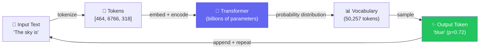

### What Makes It "Large"?

| Model | Parameters | Training Tokens | Release |
|-------|-----------|----------------|---------|
| GPT-2 | 1.5B | 40B | 2019 |
| GPT-3 | 175B | 300B | 2020 |
| LLaMA 2 | 70B | 2T | 2023 |
| GPT-4 (est.) | ~1.8T (MoE) | ~13T | 2023 |
| Claude 3 Opus | undisclosed | undisclosed | 2024 |

> **Parameters** = the learned weights in the neural network. More parameters = more capacity to learn patterns.

### The Core Task: Next Token Prediction

LLMs are trained on a deceptively simple objective:

```
Given: "The quick brown fox"
Predict: "jumps" (next token)

Given: "The quick brown fox jumps"
Predict: "over" (next token)

...and so on, across trillions of tokens.
```

By optimizing this single objective across enough data, the model learns grammar, facts, reasoning, code, math, and common sense — all as emergent capabilities.

---

## 2. The Transformer Architecture

Introduced in **"Attention Is All You Need" (Vaswani et al., 2017)**, the Transformer replaced RNNs and LSTMs as the backbone of language models. Its key innovation: processing all tokens in parallel, not sequentially.

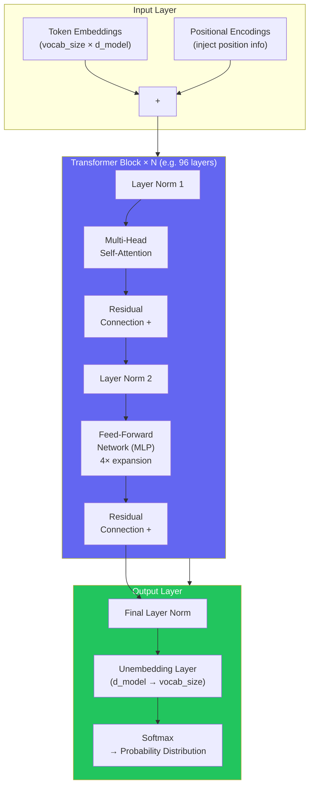

### Key Dimensions (GPT-3 as Example)

| Hyperparameter | Symbol | GPT-3 Value | Meaning |
|---------------|--------|-------------|---------|
| Model dimension | `d_model` | 12,288 | Width of each token's representation |
| Layers | `n_layers` | 96 | Number of stacked Transformer blocks |
| Attention heads | `n_heads` | 96 | Parallel attention patterns per layer |
| Head dimension | `d_head` | 128 | `d_model / n_heads` |
| FF dimension | `d_ff` | 49,152 | Inner dimension of FFN (4 × d_model) |
| Vocabulary size | `vocab_size` | 50,257 | Unique tokens the model knows |
| Context window | `n_ctx` | 2,048 | Max tokens processed at once |

### The Residual Stream

Each token travels through the network as a **residual stream** — a vector of size `d_model`. Each layer reads from this stream and *adds* information back to it. Nothing is destroyed; information accumulates.

```
Token "fox" starts as embedding vector: [0.2, -0.5, 0.8, ...]   # d_model dimensions

After Layer 1:   [0.2, -0.5, 0.8, ...] + attention_output_1
After Layer 2:   [prev] + attention_output_2
After Layer N:   [prev] + attention_output_N

Final vector → unembedding matrix → probability over all 50,257 tokens
```

---

## 3. Attention Mechanism — The Core Idea

**Self-attention** allows every token to "look at" every other token in the sequence and decide what information to gather from them.

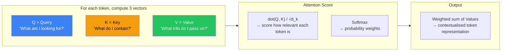

### Step-by-Step Example

```
Sentence: "The animal didn't cross the street because it was too tired"

When processing "it":
  Q_it asks:  "What does 'it' refer to?"
  K_animal:   "I'm a noun, subject of sentence"
  K_street:   "I'm a noun, object of crossing"

  Attention scores:
    animal → 0.72  ✅ (high — 'it' refers to 'animal')
    street → 0.11
    tired  → 0.09
    ...

  Output = 0.72 × V_animal + 0.11 × V_street + ...
  → "it" now carries semantic context of "animal"
```

### Multi-Head Attention

Instead of one attention computation, run `n_heads` in parallel — each head can focus on different relationships (syntax, coreference, semantics, proximity):

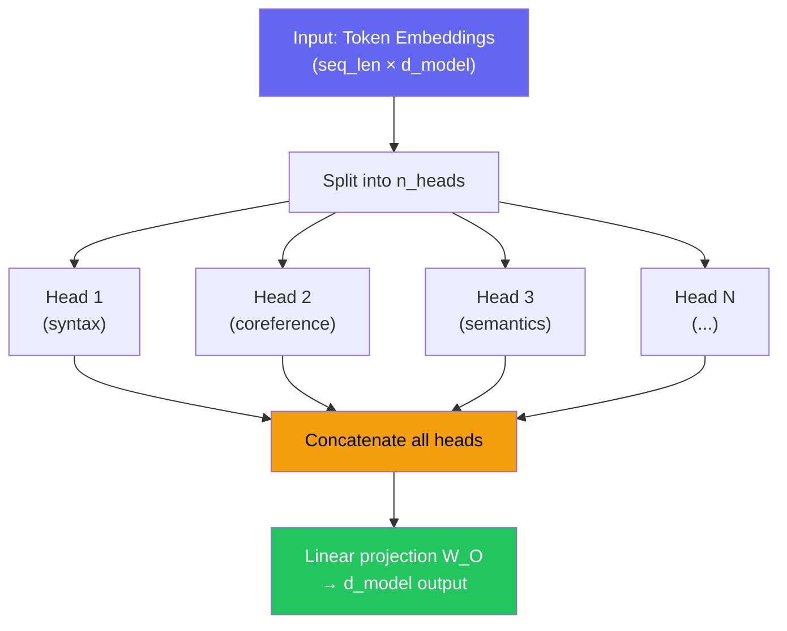

### Attention Complexity

```
Standard self-attention: O(n²·d) — quadratic in sequence length n
This is why context window expansion is hard and expensive.

Solutions for long contexts:
  - Sparse attention (Longformer, BigBird): O(n·√n)
  - Flash Attention: same O(n²) math but IO-efficient GPU kernel
  - Sliding window attention (Mistral): only attend to nearby tokens
  - Grouped Query Attention (GQA): fewer KV heads, lower memory
```

### The Feed-Forward Network (FFN)

After attention, each token passes through a 2-layer MLP independently:

```python
# Pseudocode for one FFN block
def ffn(x, W1, W2):
    # W1: d_model → d_ff  (e.g. 12288 → 49152, 4× expansion)
    # W2: d_ff → d_model
    return W2 @ gelu(W1 @ x)
```

> The FFN is where most of the model's **factual knowledge** is stored — as patterns in the weight matrices. Attention routes information; FFN stores knowledge.

---

## 4. Tokenization

Before an LLM processes text, it must be converted to tokens — integer IDs from a fixed vocabulary.

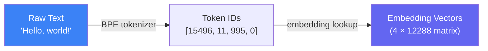

### Byte Pair Encoding (BPE)

BPE is the most common tokenization algorithm (used by GPT-2/3/4, LLaMA):

```
Start: character-level vocabulary
       {"h", "e", "l", "o", " ", "w", "r", "d", ...}

Step 1: Find most frequent adjacent pair → merge
        "l" + "l" → "ll"  (if "ll" appears 10,000 times)

Step 2: Find next most frequent pair → merge
        "he" + "ll" → "hell" (if this pair is frequent)

Repeat until vocabulary reaches target size (e.g. 50,257 for GPT-2)

Final vocabulary includes:
  Common words:   "the"(262), "is"(318), " world"(995)
  Subwords:       "ing"(278), "tion"(295), "##ment"
  Characters:     "z"(89), "x"(87)
  Special tokens: <|endoftext|>(50256), <|pad|>
```

### Why Tokenization Matters

```
"unhappiness" → ["un", "happiness"]       ✅ 2 tokens — efficient
"cryptocurrency" → ["crypt", "o", "currency"] — 3 tokens
"aaaaaa" → ["a", "a", "a", "a", "a", "a"] — 6 tokens — inefficient

Impact on context window:
  GPT-4's 128k context ≠ 128k words
  ≈ 128k tokens ≈ ~96,000 English words
  (1 token ≈ 0.75 words on average)

Impact on arithmetic:
  "100" → 1 token   → model sees it as one unit ✅
  "1,000,000" → ["1", ",", "000", ",", "000"] → harder to reason about
```

---

## 5. Pre-Training Pipeline

This is where the LLM learns from raw text. The most compute-intensive phase — GPT-3 cost ~$4.6M in compute; GPT-4 estimated at $100M+.

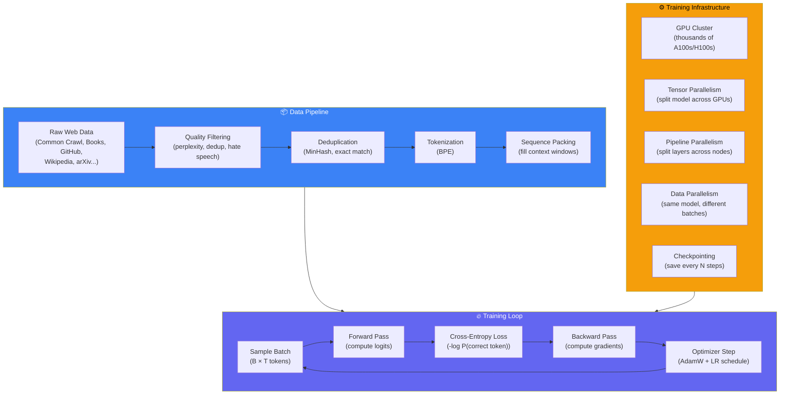

### The Training Objective: Cross-Entropy Loss

```
For each position in a sequence, the model predicts the next token.
Loss = -log(probability assigned to the correct token)

Example:
  Input:  "The sky is"
  Correct next token: "blue" (token ID 4171)
  Model output: P("blue") = 0.72

  Loss = -log(0.72) = 0.329  ← low loss, model was confident and correct

  If P("blue") = 0.01:
  Loss = -log(0.01) = 4.605  ← high loss, model was wrong/uncertain

Training minimizes this loss averaged over all tokens in all batches.
```

### Training Data Composition (Typical)

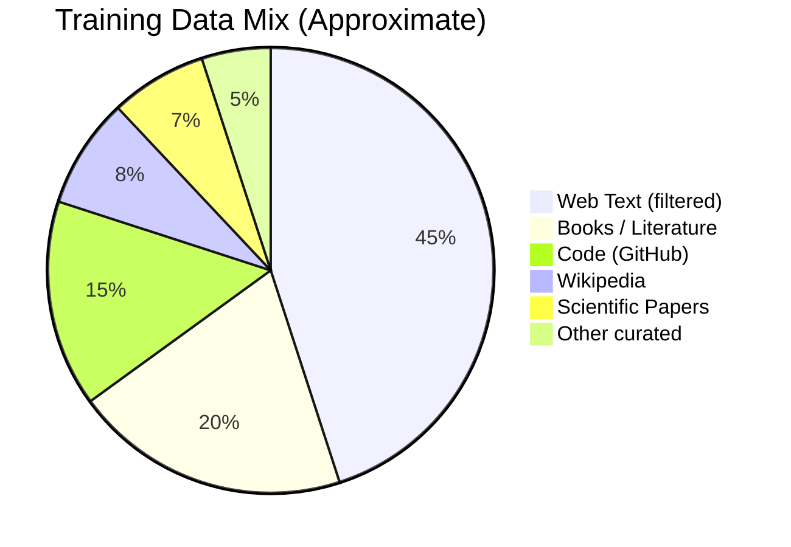

### Distributed Training — 3D Parallelism

At the scale of GPT-4, a single GPU holds only a fraction of the model. Training requires three types of parallelism working together:

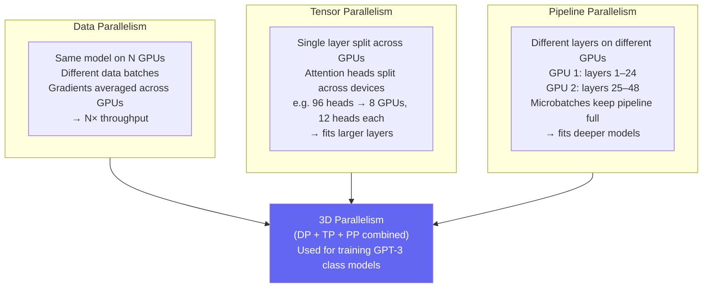

### The Chinchilla Scaling Law

From DeepMind's 2022 paper — the optimal relationship between model size (N) and training tokens (D):

```
Optimal: D ≈ 20 × N

Examples:
  7B parameter model  → train on ~140B tokens
  70B parameter model → train on ~1.4T tokens
  GPT-3 (175B)        → undertrained! Only 300B tokens
                         optimal would be ~3.5T tokens

Key insight: for a fixed compute budget, it's better to train
a SMALLER model on MORE data than a LARGER model on less data.

→ This led to LLaMA, Mistral, Phi — smaller but well-trained models
  that outperform larger undertrained ones.
```

### Learning Rate Schedule

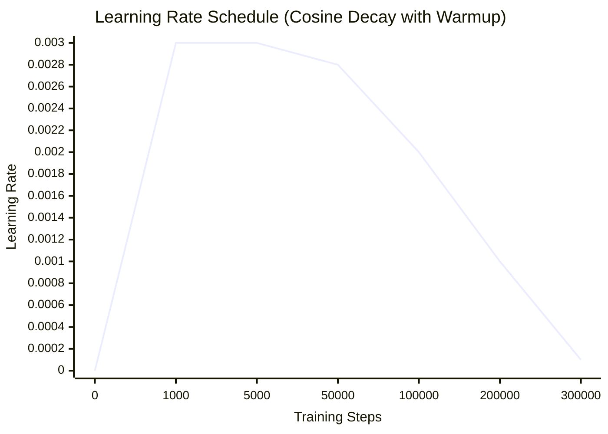

```
Phase 1 — Warmup (0 → N_warmup steps):
  LR increases linearly from 0 to max_lr
  Prevents unstable early gradient updates

Phase 2 — Decay (N_warmup → N_total steps):
  LR decays via cosine schedule to ~10% of max_lr
  Allows model to settle into sharp minima

Typical values:
  max_lr: 3e-4 (AdamW default, scaled by model size)
  warmup: 0.1–1% of total steps
  min_lr: 1e-5
```

---

## 6. Fine-Tuning Strategies

Pre-training produces a **base model** — good at next token prediction but not yet at following instructions. Fine-tuning aligns the model to specific tasks or behaviours.

```mermaid
flowchart LR
    BASE["🧠 Base LLM\n(pre-trained)"] -->|fine-tune| INSTRUCT["📋 Instruction-Following\nModel"]
    BASE -->|fine-tune| DOMAIN["🏥 Domain-Specific\nModel (medical, legal)"]
    BASE -->|fine-tune| CODE["💻 Code Model\n(GitHub Copilot)"]
    BASE -->|fine-tune| CHAT["💬 Chat Model\n(conversational)"]

    style BASE fill:#6366f1,color:#fff
    style INSTRUCT fill:#22c55e,color:#fff
    style DOMAIN fill:#f59e0b,color:#000
    style CODE fill:#3b82f6,color:#fff
    style CHAT fill:#ec4899,color:#fff
```

### 6.1 Full Fine-Tuning

Update all parameters on task-specific data. Expensive but most powerful.

```python
# Full fine-tuning pseudocode
model = load_pretrained("llama-70b")
optimizer = AdamW(model.parameters(), lr=2e-5)

for batch in instruction_dataset:
    inputs, labels = batch
    logits = model(inputs)
    loss = cross_entropy(logits, labels)
    loss.backward()
    optimizer.step()
```

```
✅ Maximum performance gain
❌ Requires same compute as pre-training
❌ Catastrophic forgetting — can lose base capabilities
❌ 70B model × 4 bytes = 280GB just to store gradients
```

---

### 6.2 LoRA — Low-Rank Adaptation ⭐ Most Popular

Instead of updating all weights, inject small trainable low-rank matrices alongside frozen pre-trained weights.

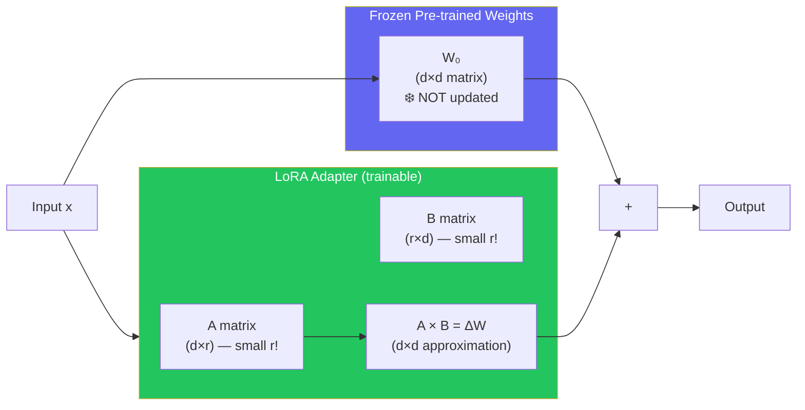

```python
from peft import LoraConfig, get_peft_model

config = LoraConfig(
    r=16,           # rank — typical values: 4, 8, 16, 64
    lora_alpha=32,  # scaling factor
    target_modules=["q_proj", "v_proj"],  # which layers to adapt
    lora_dropout=0.05,
    bias="none",
)

model = get_peft_model(base_model, config)
# Only 0.1–1% of parameters are now trainable!

# Training is identical to full fine-tuning from here
```

**Why LoRA Works:**

```
Full weight matrix W is d×d (e.g. 12288 × 12288 = 150M params per layer)
LoRA approximates ΔW as A×B where rank r << d

r=16: A is (12288×16), B is (16×12288)
Total LoRA params: 2 × 12288 × 16 = 393,216
vs full matrix: 150,994,944

Compression ratio: 384× fewer parameters to train!

Yet performance is within 1–2% of full fine-tuning on most tasks.
```

---

### 6.3 Prompt Tuning / Prefix Tuning

Add learnable "soft prompt" tokens to the input. Model weights stay frozen.

```
Input:  [SOFT_TOKEN_1] [SOFT_TOKEN_2] [SOFT_TOKEN_3] + real input tokens
        ↑ these are learned vectors, not real words

Only ~0.01% of model parameters trained.
```

```
✅ Extremely parameter-efficient
✅ Easy to swap task-specific prompts
❌ Lower performance ceiling than LoRA
❌ Harder to interpret
```

---

### Fine-Tuning Data Format (Instruction Tuning)

```json
// Alpaca format
{
  "instruction": "Summarize the following text in 2 sentences.",
  "input": "The Great Wall of China is a series of fortifications...",
  "output": "The Great Wall of China is an ancient series of walls built to protect against invasions. It stretches over 13,000 miles across northern China."
}

// ChatML format (OpenAI, used by many models)
<|im_start|>system
You are a helpful assistant.<|im_end|>
<|im_start|>user
What is the capital of France?<|im_end|>
<|im_start|>assistant
The capital of France is Paris.<|im_end|>
```

---

## 7. RLHF — Aligning LLMs with Human Preferences

Reinforcement Learning from Human Feedback is the technique that transforms a base LLM into a **helpful, harmless, and honest** assistant (ChatGPT, Claude, Gemini all use variants of this).

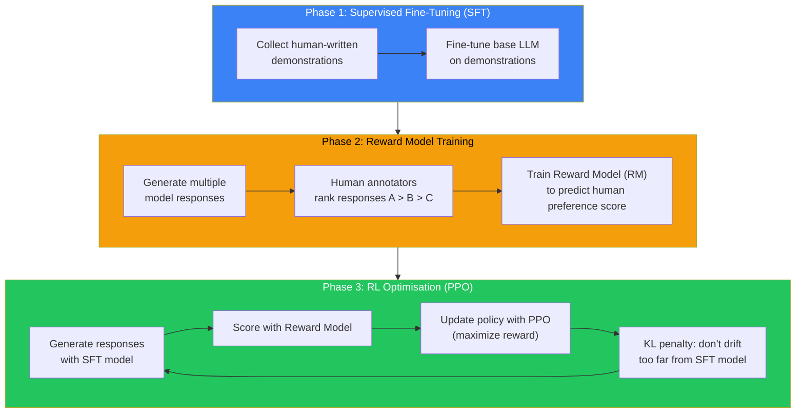

### The Reward Model

```python
# Reward model takes a (prompt, response) pair and outputs a scalar score

class RewardModel(nn.Module):
    def __init__(self, base_model):
        super().__init__()
        self.transformer = base_model   # same architecture as LLM
        self.value_head = nn.Linear(d_model, 1)  # outputs single scalar

    def forward(self, input_ids):
        hidden = self.transformer(input_ids)
        last_hidden = hidden[:, -1, :]  # take last token's representation
        reward = self.value_head(last_hidden)
        return reward  # scalar: higher = more aligned response

# Training: given pair (response_A, response_B) where human prefers A:
# Loss = -log(sigmoid(reward_A - reward_B))
```

### RLHF Alternatives

| Method | Description | Used by |
|--------|-------------|---------|
| **PPO (RLHF)** | Classic RL with reward model | InstructGPT, early ChatGPT |
| **DPO** (Direct Preference Optimisation) | Skip RL entirely, optimize directly on preferences | LLaMA 3, Zephyr |
| **RLAIF** | Use AI (not humans) to generate preference labels | Claude, Gemini (partly) |
| **Constitutional AI** | Model critiques and revises its own outputs | Claude (Anthropic) |

---

## 8. Inference — How Text is Generated

Once trained, an LLM generates text through **autoregressive decoding** — one token at a time, each token conditioned on all previous ones.

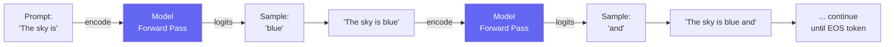

### Decoding Strategies

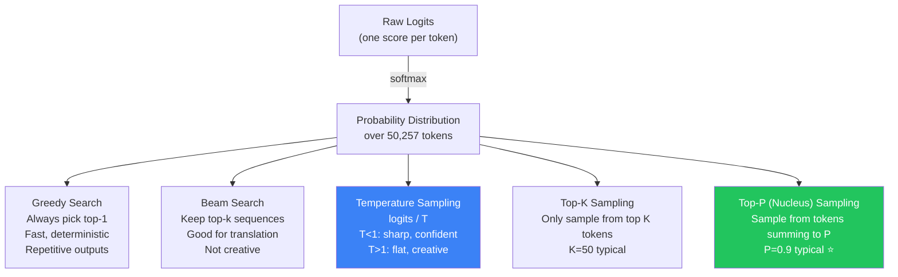

### Temperature and Top-P Explained

```
Temperature = 0.1 (conservative):
  Original probs:  [0.5, 0.3, 0.15, 0.05]
  After T=0.1:     [0.99, 0.01, 0.00, 0.00]  ← extremely peaked
  Effect: always picks "blue", very deterministic

Temperature = 1.5 (creative):
  After T=1.5:     [0.32, 0.28, 0.25, 0.15]  ← very flat
  Effect: surprising/random outputs

Temperature = 1.0 (default):
  Probabilities unchanged → natural distribution

Top-P = 0.9:
  Sort tokens by probability: ["blue":0.52, "grey":0.21, "clear":0.12, ...]
  Keep adding until cumulative P ≥ 0.9
  Only sample from this dynamic subset
  → More principled than top-K (adapts to distribution shape)
```

### KV Cache — The Key Inference Optimization

Without caching: every new token requires recomputing attention for ALL previous tokens.

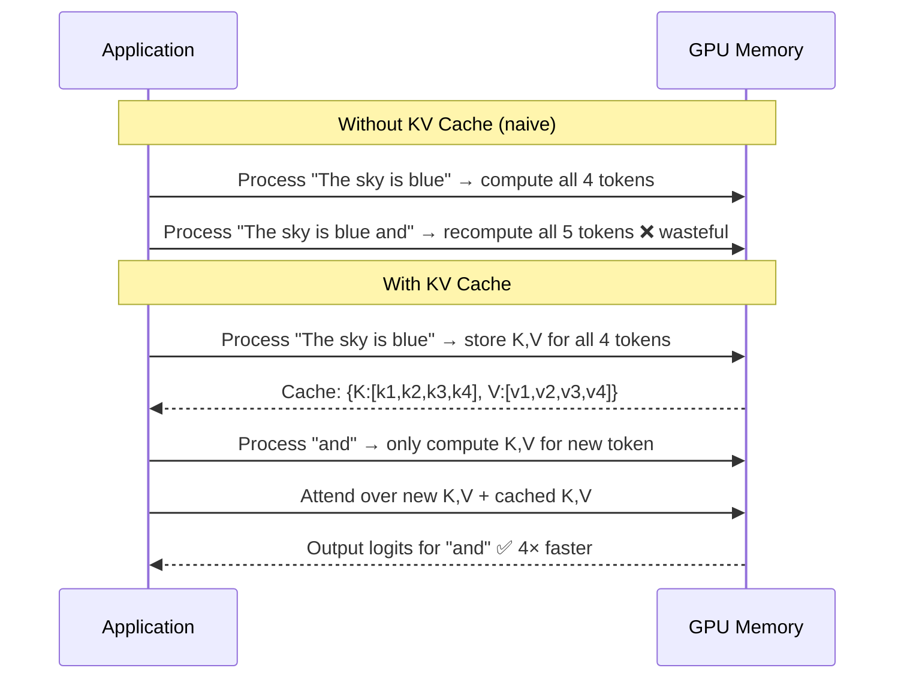

```
Memory cost of KV cache:
  Per token: 2 × n_layers × d_head × n_kv_heads × dtype_bytes
  GPT-3:     2 × 96 × 128 × 96 × 2 (fp16) = 4.7 MB per token
  At 2048 tokens context: 4.7MB × 2048 ≈ 9.6 GB per sequence

This is why batching and context window management is critical for inference.
```

---

## 9. System Design — Serving LLMs at Scale

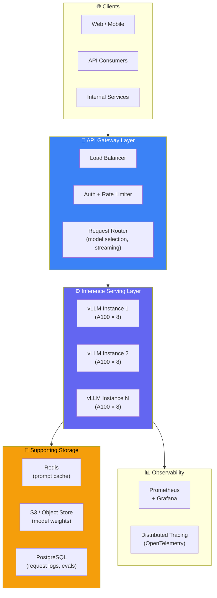

### Continuous Batching

Naive batching waits for B requests then processes together. **Continuous batching** (iteration-level scheduling) processes new requests as soon as a slot frees up:

```mermaid
gantt
    title Continuous Batching vs Naive Batching
    dateFormat X
    axisFormat %s

    section Naive Batch (wait for B requests)
    Wait for batch        :done, 0, 3
    Req 1+2+3 together    :done, 3, 5
    Wait for next batch   :done, 8, 3
    Req 4+5+6 together    :done, 11, 5

    section Continuous Batching (vLLM)
    Req 1 starts          :done, 0, 6
    Req 2 joins at step 1 :done, 1, 5
    Req 3 joins at step 2 :done, 2, 4
    Req 4 joins when slot frees :done, 6, 5
```

```
Result: GPU utilisation goes from ~40% (naive) to ~80%+ (continuous batching)
This is the core innovation in vLLM and TensorRT-LLM.
```

### PagedAttention (vLLM)

Manages KV cache like virtual memory — eliminates fragmentation:

```
Problem: 
  Request A needs 2000 tokens of KV cache (allocated contiguously)
  Request B needs 500 tokens of KV cache
  Request A finishes → leaves a 2000-token hole
  Request C needs 1800 tokens → can't fit in hole without compaction

PagedAttention:
  KV cache split into fixed-size "pages" (e.g. 16 tokens each)
  Pages allocated on demand, non-contiguous
  → Same as OS virtual memory for processes
  → 55% higher throughput vs naive KV cache management
```

### Inference Stack Options

| Framework | Best For | Key Feature |
|-----------|---------|-------------|
| **vLLM** | Production serving, OpenAI-compatible API | PagedAttention, continuous batching |
| **TensorRT-LLM** | NVIDIA GPUs, maximum throughput | Kernel fusion, INT8/FP8 quantisation |
| **llama.cpp** | CPU/edge inference | GGUF quantisation, runs on laptop |
| **Ollama** | Local development | Wraps llama.cpp, easy API |
| **HuggingFace TGI** | Flexibility, research | Many model formats, LoRA serving |

---

## 10. Inference Optimization Techniques

### Quantisation

Reduce precision of model weights to save memory and increase speed:

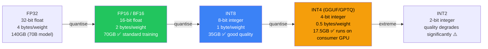

```python
# Load model in 4-bit with bitsandbytes
from transformers import AutoModelForCausalLM, BitsAndBytesConfig

quantization_config = BitsAndBytesConfig(
    load_in_4bit=True,
    bnb_4bit_quant_type="nf4",      # NormalFloat4 — best quality/compression
    bnb_4bit_use_double_quant=True,  # quantise the quantisation constants too
    bnb_4bit_compute_dtype=torch.bfloat16
)

model = AutoModelForCausalLM.from_pretrained(
    "meta-llama/Llama-2-70b-hf",
    quantization_config=quantization_config,
    device_map="auto"
)
# 70B model now fits on 2× A100 40GB instead of 4× A100 80GB
```

### Speculative Decoding

Use a small "draft model" to propose multiple tokens; large model verifies in parallel:

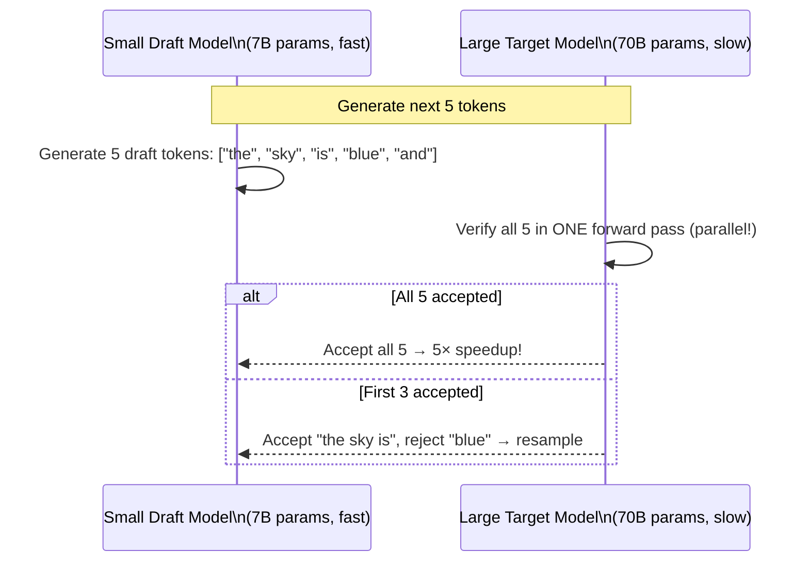

```
Result: 2–4× speedup with no quality degradation
Used by: Gemini, Claude, GPT-4 Turbo (reportedly)
Requirement: draft model must have same tokenizer as target
```

### Flash Attention

Rewrites the attention computation to be **IO-aware** — minimizes reads/writes to slow HBM (GPU high-bandwidth memory):

```
Standard attention: reads/writes Q, K, V, S (attention scores), P (softmax) to HBM
  → O(n²) memory reads/writes

Flash Attention: fuses softmax + matmul into single kernel, tiles computation
  → Never materializes full n×n attention matrix in HBM
  → 2–4× faster, 5–10× less memory
  → Same mathematical output — not an approximation
```

---

## 11. RAG — Retrieval-Augmented Generation

LLMs have a knowledge cutoff and can hallucinate. RAG grounds responses in retrieved, up-to-date documents.

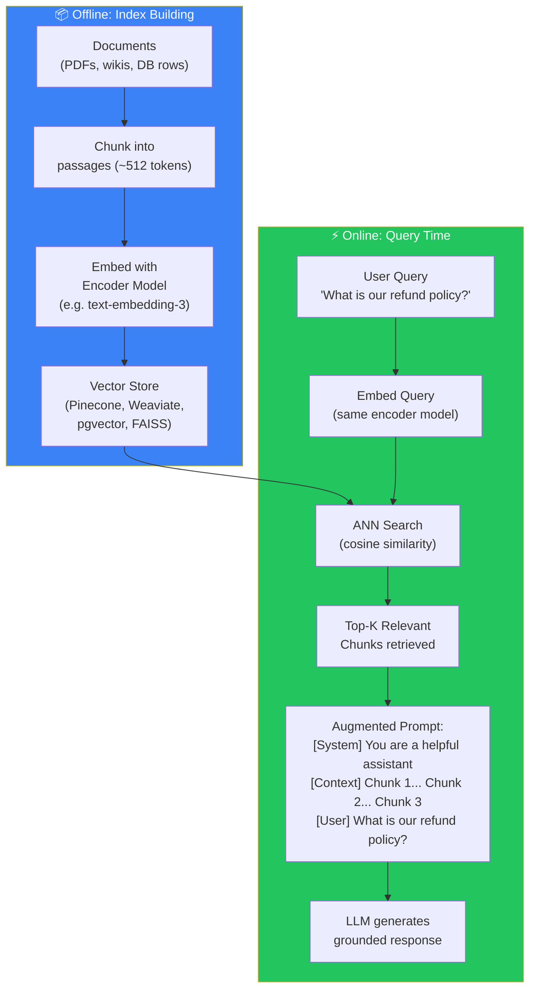

### RAG vs Fine-Tuning — When to Use Which

| Situation | Use RAG | Use Fine-Tuning |
|-----------|---------|-----------------|
| Knowledge changes frequently | ✅ | ❌ (retrain needed) |
| Need to cite sources | ✅ | ❌ |
| Large proprietary knowledge base | ✅ | ❌ (expensive) |
| Need to change model behaviour/style | ❌ | ✅ |
| Domain-specific reasoning patterns | ❌ | ✅ |
| Reduce hallucination on facts | ✅ | ⚠️ (partial) |

### Vector Similarity Search

```python
# pgvector example (PostgreSQL extension)
import psycopg2
from openai import OpenAI

client = OpenAI()

def search_documents(query: str, top_k: int = 5) -> list[dict]:
    # Embed the query
    embedding = client.embeddings.create(
        input=query,
        model="text-embedding-3-large"
    ).data[0].embedding  # 3072-dimension vector

    # ANN search in pgvector
    conn = psycopg2.connect(DATABASE_URL)
    results = conn.execute("""
        SELECT content, metadata,
               1 - (embedding <=> %s::vector) AS similarity
        FROM documents
        ORDER BY embedding <=> %s::vector
        LIMIT %s
    """, (embedding, embedding, top_k)).fetchall()

    return [{"content": r[0], "similarity": r[2]} for r in results]

def rag_answer(question: str) -> str:
    # Retrieve relevant context
    docs = search_documents(question, top_k=3)
    context = "\n\n".join([d["content"] for d in docs])

    # Augment prompt
    response = client.chat.completions.create(
        model="gpt-4o",
        messages=[
            {"role": "system", "content": "Answer based on the context provided. If unsure, say so."},
            {"role": "user", "content": f"Context:\n{context}\n\nQuestion: {question}"}
        ]
    )
    return response.choices[0].message.content
```

---

## 12. Evaluation & Observability

### Evaluation Benchmarks

| Benchmark | Tests | Notes |
|-----------|-------|-------|
| **MMLU** | Multi-task language understanding (57 subjects) | Gold standard for general knowledge |
| **HumanEval** | Python code generation (164 problems) | Measures coding ability |
| **GSM8K** | Grade school math word problems | Measures arithmetic reasoning |
| **HellaSwag** | Commonsense NLI | Measures common sense |
| **TruthfulQA** | Truthfulness on misleading questions | Measures hallucination resistance |
| **MT-Bench** | Multi-turn instruction following | Human-preference-aligned evaluation |

### Production Observability Metrics

```mermaid
mindmap
  root((LLM Observability))
    Latency
      Time to first token (TTFT)
      Time per output token (TPOT)
      Total request latency
      p50 / p95 / p99
    Throughput
      Tokens per second per GPU
      Requests per second
      Batch efficiency
    Quality
      Hallucination rate
      User thumbs-up/down
      Guardrail trigger rate
    Cost
      Cost per 1M input tokens
      Cost per 1M output tokens
      GPU utilisation %
    Errors
      Timeout rate
      Context overflow rate
      Safety filter rate
```

### Prometheus Metrics for LLM Serving

```python
from prometheus_client import Histogram, Counter, Gauge

# Time to first token — most important UX metric
ttft = Histogram(
    "llm_time_to_first_token_seconds",
    "Time from request to first output token",
    buckets=[0.1, 0.25, 0.5, 1.0, 2.0, 5.0]
)

# Tokens per second
tps = Histogram(
    "llm_output_tokens_per_second",
    "Generation throughput",
    buckets=[10, 25, 50, 100, 200, 500]
)

# Total tokens generated
tokens_generated = Counter(
    "llm_tokens_total",
    "Total tokens generated",
    ["model", "type"]   # type: input | output
)

# Active requests (for monitoring batch size)
active_requests = Gauge(
    "llm_active_requests",
    "Currently inflight requests"
)

# KV cache utilisation
kv_cache_usage = Gauge(
    "llm_kv_cache_utilisation",
    "Fraction of KV cache in use",
    ["instance"]
)
```

### Guardrails & Safety

```mermaid
flowchart LR
    INPUT["User Prompt"] --> IN_GUARD["Input Guardrail\n• PII detection\n• Prompt injection\n• Content policy"]
    IN_GUARD -->|safe| LLM["LLM\nInference"]
    IN_GUARD -->|violation| BLOCK1["Block +\nLog + Alert"]
    LLM --> OUT_GUARD["Output Guardrail\n• Hallucination check\n• Toxicity filter\n• PII in output\n• Factuality check"]
    OUT_GUARD -->|safe| USER["Return to User"]
    OUT_GUARD -->|violation| BLOCK2["Block/Redact +\nLog + Alert"]

    style IN_GUARD fill:#f59e0b,color:#000
    style OUT_GUARD fill:#f59e0b,color:#000
    style BLOCK1 fill:#ef4444,color:#fff
    style BLOCK2 fill:#ef4444,color:#fff
```

---

## 13. Advanced Topics

### Mixture of Experts (MoE)

Instead of activating all parameters for every token, use a **router** to activate only a subset of "expert" FFN layers:

```mermaid
flowchart LR
    TOKEN["Token\nRepresentation"] --> ROUTER["Router\n(learned linear layer)"]
    ROUTER -->|weight 0.6| E1["Expert 1\n(FFN)"]
    ROUTER -->|weight 0.3| E3["Expert 3\n(FFN)"]
    ROUTER -->|weight 0.1| E7["Expert 7\n(FFN)"]
    ROUTER -->|weight ~0| E2["Expert 2\n(inactive)"]
    ROUTER -->|weight ~0| E4["Expert 4\n(inactive)"]
    E1 --> COMBINE["Weighted\nCombination"]
    E3 --> COMBINE
    E7 --> COMBINE
    COMBINE --> OUTPUT["Output"]

    style ROUTER fill:#6366f1,color:#fff
    style COMBINE fill:#22c55e,color:#fff
```

```
GPT-4 is believed to be an MoE model:
  ~1.8T total parameters
  ~220B active parameters per token (only ~12% active at once)

Benefits:
  - Scale model capacity without proportional compute cost
  - Different experts specialise in different domains
  - Same inference cost as a ~220B dense model

Used by: GPT-4, Mixtral 8×7B (open-source), Gemini 1.5
```

### Context Window Scaling Techniques

```
RoPE (Rotary Positional Encoding):
  Standard encoding: uses absolute positions 1, 2, 3...
  RoPE: encodes relative positions via rotation in complex space
  → More generalizable to longer sequences
  → Used by LLaMA, Mistral, Gemma

YaRN / LongRoPE:
  Extends RoPE to 10x longer contexts without full retraining
  LLaMA 3 context extended from 8k → 128k tokens this way

ALiBi (Attention with Linear Biases):
  Adds negative bias proportional to distance between tokens
  → Naturally generalizes to longer sequences
  → MPT-7B, BLOOM use this
```

### Prompt Engineering Patterns

```python
# Zero-shot
"What is the capital of France?"

# Few-shot (in-context learning)
"""
Q: What is the capital of Germany? A: Berlin
Q: What is the capital of Japan? A: Tokyo
Q: What is the capital of France? A:"""

# Chain of Thought (CoT)
"""Solve this step by step:
If John has 5 apples and gives 2 to Mary and buys 3 more, how many does he have?

Let me think through this:
1. John starts with 5 apples
2. He gives 2 away: 5 - 2 = 3 apples
3. He buys 3 more: 3 + 3 = 6 apples
Answer: 6 apples"""

# ReAct (Reasoning + Acting)
"""
Thought: I need to find the current weather in Bengaluru
Action: search("current weather Bengaluru")
Observation: 28°C, partly cloudy
Thought: I have the answer
Answer: It is 28°C and partly cloudy in Bengaluru.
"""
```

---

## 14. Interview Cheat Sheet

### The Golden Mental Model

```
LLM = very large function: tokens_in → probability_distribution_over_vocab

Training = minimizing cross-entropy loss on next-token prediction
           across trillions of tokens

Architecture = Transformer:
  Embeddings → [Attention + FFN] × N layers → Unembedding → Softmax

Key insight: Attention routes information between tokens
             FFN stores factual knowledge in weights
             Residual stream carries information through layers

Generation = sample from distribution repeatedly (autoregressive)
```

### Architecture Numbers to Know

| Concept | Detail |
|---------|--------|
| Transformer components | Embedding → (Attention + FFN) × N → Unembed |
| Attention formula | softmax(QKᵀ / √d_k) × V |
| FFN expansion | 4× d_model typical |
| Training objective | Cross-entropy loss on next token |
| Tokenizer algorithm | BPE (most common), SentencePiece |
| KV cache memory | ~2 × n_layers × d_head × n_kv_heads × dtype per token |
| Chinchilla law | Optimal tokens ≈ 20 × parameters |

### Common Interview Questions

| Question | Key Answer |
|----------|-----------|
| What is self-attention? | Each token attends to all others. Computes Q, K, V; scores = softmax(QKᵀ/√d); output = weighted sum of V |
| Why Transformer over RNN? | Parallel processing of all tokens; no vanishing gradients; better long-range dependencies |
| What is the training objective? | Next-token prediction via cross-entropy loss. Predicts P(next token | all previous tokens) |
| What is temperature? | Scales logits before softmax. Low T = sharp/deterministic, High T = flat/creative |
| What is KV cache? | Stores computed K, V vectors for past tokens. Avoids recomputing on each generation step |
| What is LoRA? | Low-rank adaptation — injects small trainable matrices A, B alongside frozen weights. ΔW ≈ AB |
| What is RAG? | Retrieval-Augmented Generation — retrieve relevant docs at query time, inject into context |
| What is hallucination? | Model generates plausible-sounding but factually incorrect text. Mitigated by RAG, grounding, RLHF |
| What is RLHF? | Train a reward model on human preferences; use PPO to optimize LLM to maximize reward |
| What is MoE? | Mixture of Experts — only a subset of FFN layers activate per token. Scales params without scaling compute |
| What is Flash Attention? | IO-aware attention kernel that fuses operations to avoid materialising full n×n matrix in HBM |
| What is speculative decoding? | Small model generates draft; large model verifies in parallel. 2–4× speedup without quality loss |

### The LLM System Design Flow

```
1. REQUIREMENTS  → batch vs real-time, latency SLO, cost budget, context window needs
2. MODEL CHOICE  → proprietary API (GPT-4, Claude) vs self-hosted open-source (LLaMA, Mistral)
3. SERVING       → vLLM / TensorRT with continuous batching + PagedAttention
4. OPTIMIZATION  → quantisation (INT4/INT8), speculative decoding, Flash Attention
5. AUGMENTATION  → RAG for knowledge retrieval; fine-tuning (LoRA) for behaviour
6. SAFETY        → input/output guardrails, PII filtering, content policy
7. OBSERVE       → TTFT, tokens/sec, GPU utilisation, hallucination rate, cost/token
```

---

## 📚 Further Reading

- [Attention Is All You Need — Vaswani et al. (2017)](https://arxiv.org/abs/1706.03762) — The original Transformer paper
- [Language Models are Few-Shot Learners — Brown et al. (2020)](https://arxiv.org/abs/2005.14165) — GPT-3 paper
- [Training language models to follow instructions — Ouyang et al. (2022)](https://arxiv.org/abs/2203.02155) — InstructGPT / RLHF paper
- [LoRA: Low-Rank Adaptation of Large Language Models](https://arxiv.org/abs/2106.09685) — Hu et al. (2021)
- [Flash Attention](https://arxiv.org/abs/2205.14135) — Dao et al. (2022)
- [Chinchilla Scaling Laws — Hoffmann et al. (2022)](https://arxiv.org/abs/2203.15556)
- [LLM Visualization](https://bbycroft.net/llm) — Interactive step-by-step Transformer walkthrough
- [Andrej Karpathy — nanoGPT](https://github.com/karpathy/nanoGPT) — GPT-2 from scratch in ~300 lines of Python
- [vLLM Paper — PagedAttention](https://arxiv.org/abs/2309.06180)

---

*Study guide by Manas Ranjan Dash · Part of the [software-design](https://github.com/simplymanas/software-design) series*
*Prev: Distributed Cache | Next: Notification System*
