# 🚦 Rate Limiter — Complete System Design Guide

> **Study Guide** | Author: Manas | Level: Senior → Staff Engineer
> 
> A production-grade deep dive into designing a distributed rate limiting service from first principles — algorithm selection, data layer, race conditions, failure handling, API contracts, and observability.

---

## 📋 Table of Contents

1. [What is a Rate Limiter?](#1-what-is-a-rate-limiter)
2. [Why Do We Need One?](#2-why-do-we-need-one)
3. [Clarifying Requirements](#3-clarifying-requirements)
4. [High-Level Architecture](#4-high-level-architecture)
5. [Rate Limiting Algorithms](#5-rate-limiting-algorithms)
6. [Algorithm Comparison & Decision](#6-algorithm-comparison--decision)
7. [Data Layer Design](#7-data-layer-design)
8. [Distributed Consistency — Race Conditions](#8-distributed-consistency--race-conditions)
9. [Failure Modes & Resilience](#9-failure-modes--resilience)
10. [API Contract](#10-api-contract)
11. [Client SDK Design](#11-client-sdk-design)
12. [Scalability & Deployment](#12-scalability--deployment)
13. [Observability](#13-observability)
14. [Advanced Topics](#14-advanced-topics)
15. [Interview Cheat Sheet](#15-interview-cheat-sheet)

---

## 1. What is a Rate Limiter?

A **rate limiter** controls how many requests a client can make to a service within a defined time window. It sits between the client and the API server, acting as a gatekeeper.

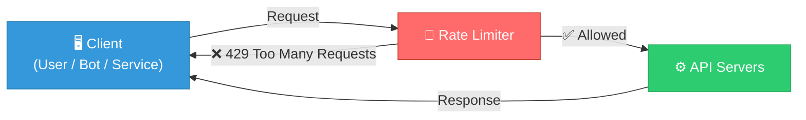

### Key Concepts

| Term | Definition |
|------|-----------|
| **Limit Key** | The entity being rate-limited (user ID, IP, API key, tenant) |
| **Window** | The time period over which the limit is measured (1s, 1min, 1day) |
| **Quota** | Maximum number of requests allowed in a window |
| **Throttling** | The act of rejecting or delaying requests that exceed the quota |
| **Hard Limit** | Requests above the quota are rejected immediately |
| **Soft Limit** | Requests above the quota are queued or delayed, not rejected |

---

## 2. Why Do We Need One?

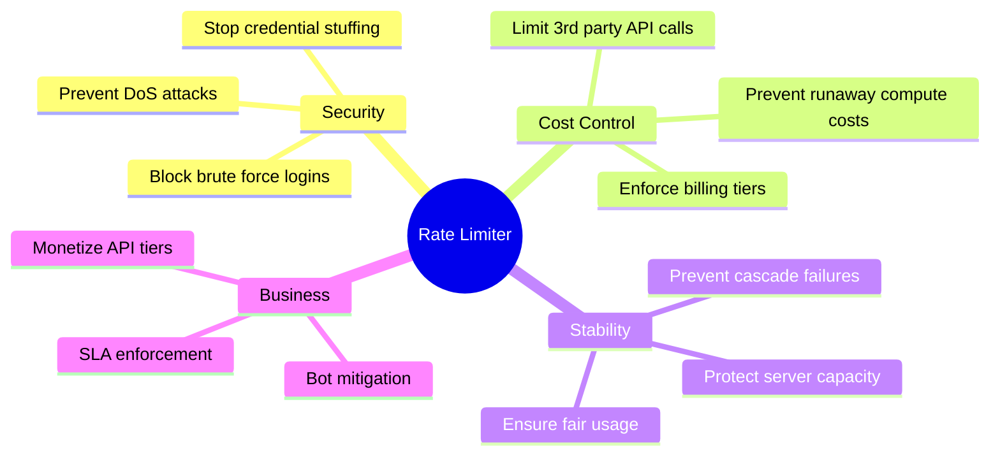

### Real-World Examples

- **Stripe** — 100 req/sec per API key
- **Twitter API** — 900 requests per 15 minutes per user
- **GitHub API** — 5000 requests per hour per user
- **OpenAI API** — Rate limited by tokens per minute per tier

---

## 3. Clarifying Requirements

> 🏆 **Senior Engineer Skill**: Never start designing without asking these questions first. It signals maturity and prevents wasted effort.

### Questions to Always Ask

```
1. WHO is being rate limited?
   → User ID? IP address? API key? Tenant (company)?
   → Single-entity or combination? (e.g., per-user-per-endpoint)

2. WHAT is the granularity?
   → Per second? Per minute? Per day?
   → Per endpoint, or global across all endpoints?

3. HOW strict must it be?
   → Hard limit (strict reject at N+1)?
   → Soft limit (allow some burst, then throttle)?

4. WHAT are the scale requirements?
   → Total RPS? (500M req/day ≈ ~5,800 RPS average, spikes to ~50k RPS)
   → How many unique clients? (10k? 10M?)
   → How many rules? (10 rules? 10,000 rules per tenant?)

5. WHERE does it sit?
   → Client-side? API Gateway? Standalone service?
   → Synchronous (in request path) or async (audit log)?

6. WHAT happens on failure?
   → Fail open (allow all) or fail closed (block all)?
```

### Our Problem Statement (Assumed)

For this design, we assume:

| Parameter | Value |
|-----------|-------|
| Scale | 500M requests/day (~5,800 avg RPS, 50k peak RPS) |
| Clients | 50+ internal microservices |
| Limit key | Per-user-ID, per-API-key |
| Window | Per minute and per second (multi-window) |
| Enforcement | Hard limit, synchronous in request path |
| Latency budget | < 1ms overhead |
| Failure mode | Fail open |

---

## 4. High-Level Architecture

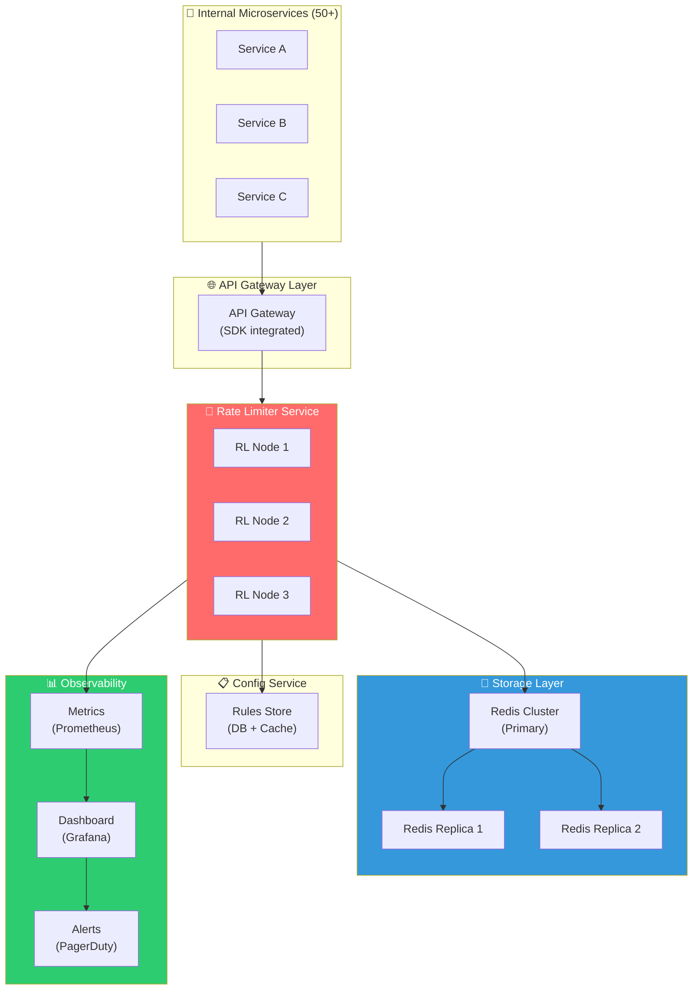

### Component Responsibilities

| Component | Responsibility |
|-----------|---------------|
| **API Gateway** | Entry point, extracts limit key from request headers |
| **Rate Limiter Nodes** | Stateless workers, evaluate rules against Redis counters |
| **Redis Cluster** | Stores all rate limit counters with TTL |
| **Config Service** | Serves rate limiting rules (limit, window, algorithm per endpoint) |
| **Prometheus** | Scrapes metrics from RL nodes |
| **Grafana** | Visualizes rejection rates, latency, per-client usage |

---

## 5. Rate Limiting Algorithms

### 5.1 Fixed Window Counter

Divide time into fixed windows (e.g., each minute). Count requests in the current window.

```mermaid
gantt
    title Fixed Window — 3 req/min limit
    dateFormat ss
    axisFormat %S

    section Window 1 (0–60s)
    req1 (allowed) :done, 0, 5s
    req2 (allowed) :done, 10, 5s
    req3 (allowed) :done, 30, 5s

    section Window 2 (60–120s)
    req4 (allowed) :done, 60, 5s
    req5 (allowed) :done, 65, 5s
    req6 (allowed) :done, 70, 5s
```

**The Edge Case Problem:**

```
Window 1: 0s────────────────────────────60s
Window 2:                               60s────────────────────120s

User sends 3 requests at 59s (Window 1, all allowed)
User sends 3 requests at 61s (Window 2, all allowed)

Result: 6 requests in 2 seconds — 2x the limit!
```

```
✅ Pros: Simple, O(1) memory per client
❌ Cons: Boundary spike — 2x traffic allowed at window edges
```

---

### 5.2 Sliding Window Log

Store a timestamp log for every request. Count timestamps in the last `window` duration.

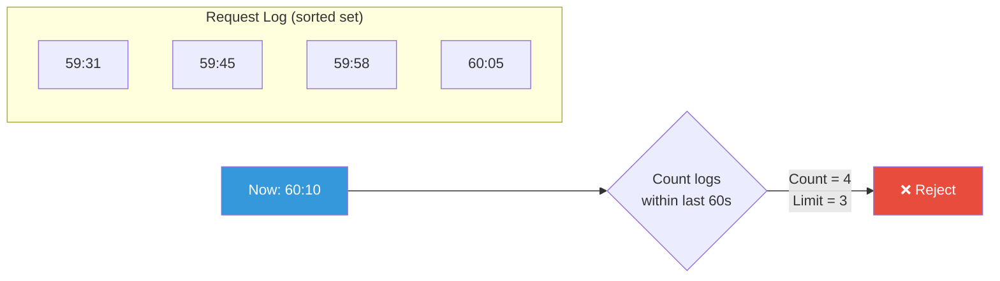

```
✅ Pros: Perfectly accurate, no boundary spike
❌ Cons: O(N) memory per client — stores every request timestamp
         At 500M req/day, memory cost is enormous
```

---

### 5.3 Sliding Window Counter (Hybrid) ⭐

A clever approximation. Use two fixed windows and interpolate.

```
Formula:
  count = current_window_count + 
          previous_window_count × (overlap_percentage)

Example:
  current window: 0–60s, you're at the 75% mark (45s in)
  → overlap with previous window = 25%
  
  prev_count = 8, curr_count = 5, limit = 10
  estimated = 5 + 8 × 0.25 = 7 → ALLOWED
```

```
✅ Pros: Very accurate (~0.003% error rate), low memory (O(1) per client)
❌ Cons: Approximate, not exact — may allow/reject at boundary
```

---

### 5.4 Token Bucket ⭐ (Our Choice)

Each client gets a "bucket" of tokens. Each request consumes one token. Tokens refill at a fixed rate.

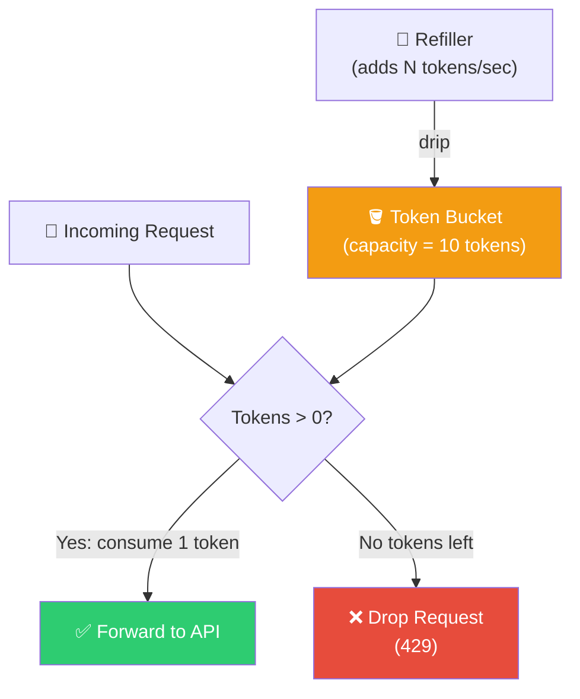

**Step-by-step Walkthrough:**

```
Limit: 3 tokens/min, Bucket Capacity: 3

T=00s  → Request 1: bucket=3 → consume → bucket=2 → ✅ ALLOWED
T=10s  → Request 2: bucket=2 → consume → bucket=1 → ✅ ALLOWED
T=30s  → Request 3: bucket=1 → consume → bucket=0 → ✅ ALLOWED
T=55s  → Request 4: bucket=0 → no tokens  → ❌ 429 REJECTED
T=60s  → Refill: bucket=3 (reset)
T=61s  → Request 5: bucket=3 → consume → bucket=2 → ✅ ALLOWED
```

```
✅ Pros: Handles burst traffic gracefully, smooth behavior
         Simple mental model, widely used in production (Stripe, AWS)
✅ Pros: Redis INCR + TTL maps perfectly to this algorithm
❌ Cons: Two parameters to tune (rate + capacity), can be tricky
❌ Cons: Not perfectly smooth — burst at bucket refill boundary
```

---

### 5.5 Leaky Bucket

Requests go into a queue (the bucket). They are processed at a fixed rate. If the queue is full, new requests are dropped.

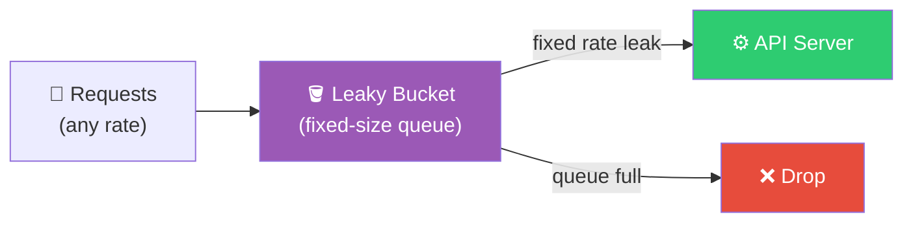

```
✅ Pros: Smoothest output — API server sees perfectly uniform traffic
❌ Cons: Recent requests are penalized (older ones processed first)
         Not suitable for burst-tolerant APIs
```

---

## 6. Algorithm Comparison & Decision


### Decision Matrix

| Algorithm | Accuracy | Memory | Burst Handling | Complexity | Production Use |
|-----------|----------|--------|---------------|------------|---------------|
| Fixed Window | ⚠️ Poor (boundary spike) | ✅ O(1) | ❌ No | ✅ Simple | Legacy systems |
| Sliding Window Log | ✅ Perfect | ❌ O(N) | ❌ No | ⚠️ Medium | Low-traffic APIs |
| Sliding Window Counter | ✅ ~99.997% | ✅ O(1) | ❌ No | ⚠️ Medium | High-traffic APIs |
| **Token Bucket** | ✅ Good | ✅ O(1) | ✅ **Yes** | ✅ Simple | **Stripe, AWS** |
| Leaky Bucket | ✅ Good | ✅ O(1) | ❌ No | ⚠️ Medium | Streaming APIs |

### ✅ Our Choice: Token Bucket

**Reasoning:**
1. At 500M req/day, we expect **traffic spikes** — token bucket handles burst gracefully
2. Redis `INCR` + `EXPIRE` maps naturally to token refill semantics
3. Per-user isolation — each user has their own bucket
4. Simple mental model for engineers consuming the service
5. Battle-tested: used by Stripe, Shopify, AWS API Gateway

---

## 7. Data Layer Design

### Why Redis?

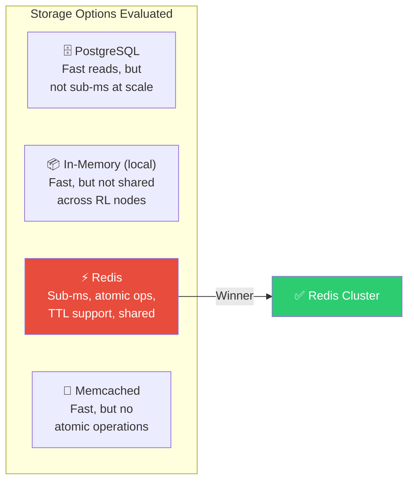

### Redis Data Structure

For each rate-limited client, we store:

```
Key format:   rl:{user_id}:{endpoint}:{window_start}
Example:      rl:user_123:/api/search:1710000000

Value:        integer counter (INCR)
TTL:          window duration (e.g., 60s)
```

**Redis Commands Used:**

```bash
# Check and increment atomically
INCR rl:user_123:/api/search:1710000000

# Set TTL on first request (only if key is new)
EXPIRE rl:user_123:/api/search:1710000000 60

# Get remaining count
GET rl:user_123:/api/search:1710000000
```

### Redis Deployment Architecture

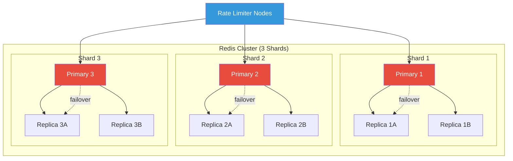

**Why Redis Cluster (not single node)?**

| Concern | Single Node | Redis Cluster |
|---------|------------|---------------|
| Capacity | ~10GB RAM | 3 × 10GB = 30GB+ |
| Throughput | ~100k ops/sec | 300k+ ops/sec |
| SPOF | ❌ Yes | ✅ No |
| Failover | ❌ Manual | ✅ Automatic |

### Key Sizing Estimate

```
Assumptions:
  - 10M unique users
  - 5 endpoints per user being tracked
  - Each key ≈ 50 bytes

Storage = 10M users × 5 endpoints × 50 bytes = 2.5 GB
→ Comfortably fits in 3-shard Redis Cluster
```

---

## 8. Distributed Consistency — Race Conditions

> 🔴 **This is the most critical section.** Most candidates skip this. Don't.

### The Problem

Without atomic operations, multiple Rate Limiter nodes can simultaneously read the same counter and all allow a request — exceeding the limit.

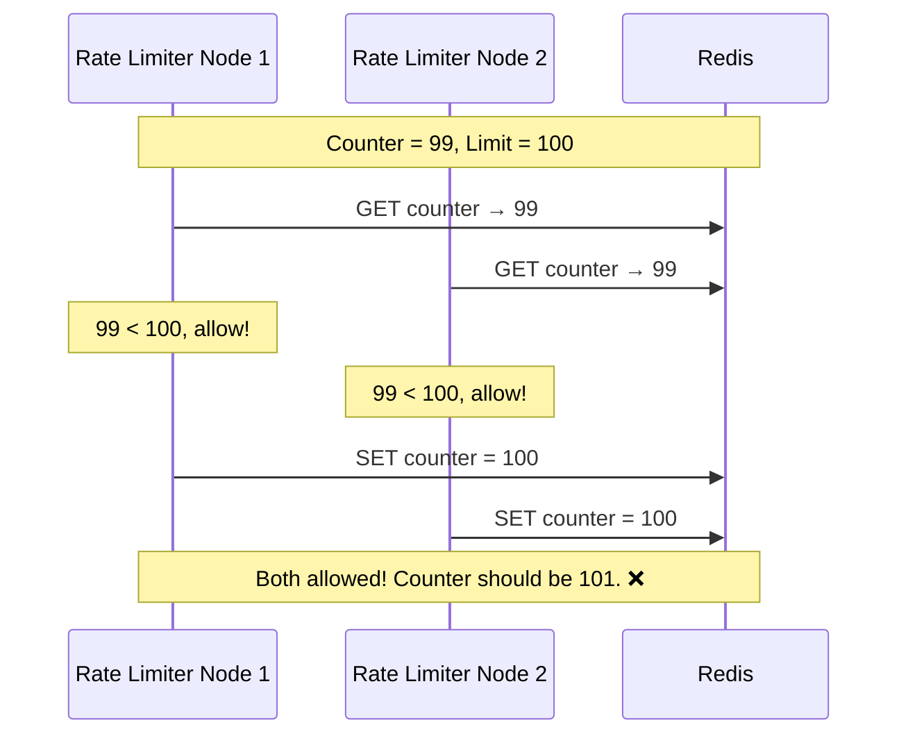

### Solution 1: Redis INCR (Atomic)

`INCR` is a single atomic operation. No two threads can interleave between read and write.

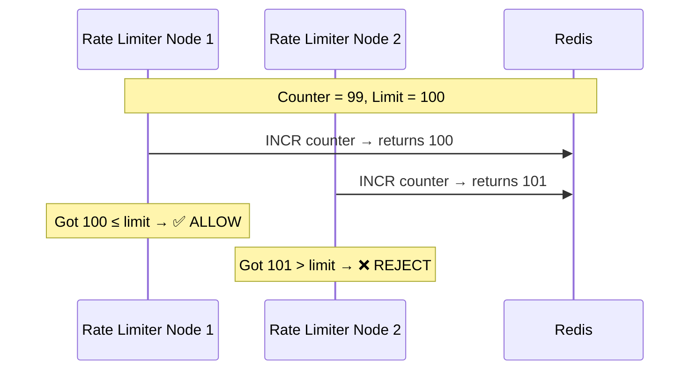

**Implementation:**

```python
def is_allowed(user_id: str, endpoint: str, limit: int, window_sec: int) -> bool:
    key = f"rl:{user_id}:{endpoint}:{int(time.time() // window_sec)}"
    
    # Atomic pipeline: INCR + EXPIRE in one round-trip
    pipe = redis.pipeline()
    pipe.incr(key)
    pipe.expire(key, window_sec)
    results = pipe.execute()
    
    current_count = results[0]
    return current_count <= limit
```

### Solution 2: Lua Script (Multi-step Atomicity)

When you need **multiple operations to be atomic** (e.g., check + increment + read TTL), use a Lua script. Redis executes Lua scripts atomically — no other command can run between steps.

```lua
-- rate_limit.lua
-- KEYS[1] = the rate limit key
-- ARGV[1] = limit
-- ARGV[2] = window in seconds

local current = redis.call('GET', KEYS[1])

if current == false then
    -- First request in this window
    redis.call('SET', KEYS[1], 1)
    redis.call('EXPIRE', KEYS[1], ARGV[2])
    return {1, tonumber(ARGV[1]) - 1, tonumber(ARGV[2])}
end

if tonumber(current) >= tonumber(ARGV[1]) then
    -- Over limit
    local ttl = redis.call('TTL', KEYS[1])
    return {0, 0, ttl}
end

-- Under limit, increment
local new_count = redis.call('INCR', KEYS[1])
local remaining = tonumber(ARGV[1]) - new_count
local ttl = redis.call('TTL', KEYS[1])
return {1, remaining, ttl}

-- Returns: {allowed (0/1), remaining, retry_after_seconds}
```

```python
# Python usage
script = redis.register_script(open("rate_limit.lua").read())
allowed, remaining, retry_after = script(
    keys=[f"rl:{user_id}:{endpoint}"],
    args=[limit, window_sec]
)
```

### Solution 3: Sliding Window with Sorted Sets

For precise sliding window, use Redis Sorted Sets (ZSET):

```python
def is_allowed_sliding(user_id: str, limit: int, window_ms: int) -> bool:
    now = int(time.time() * 1000)  # milliseconds
    key = f"rl:sliding:{user_id}"
    window_start = now - window_ms

    pipe = redis.pipeline()
    # Remove old entries outside the window
    pipe.zremrangebyscore(key, 0, window_start)
    # Count requests in current window
    pipe.zcard(key)
    # Add current request
    pipe.zadd(key, {str(now): now})
    # Set TTL
    pipe.expire(key, window_ms // 1000 + 1)
    results = pipe.execute()

    request_count = results[1]
    return request_count < limit
```

---

## 9. Failure Modes & Resilience

> 🔴 **Another section most candidates miss.** Your rate limiter is now in the critical path of every request. Its failure = your system's failure.

### Failure Scenarios

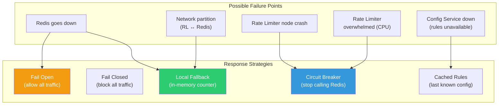

### Fail Open vs Fail Closed

```
FAIL OPEN: When rate limiter is unavailable → allow all requests

  Pros: Service stays up, users unaffected
  Cons: Abuse possible during outage, DoS risk
  Use when: User-facing APIs where availability > security

FAIL CLOSED: When rate limiter is unavailable → block all requests

  Pros: Fully secure, no abuse during outage
  Cons: Complete service outage for all users
  Use when: Financial APIs, fraud-sensitive endpoints
```

### Circuit Breaker Pattern

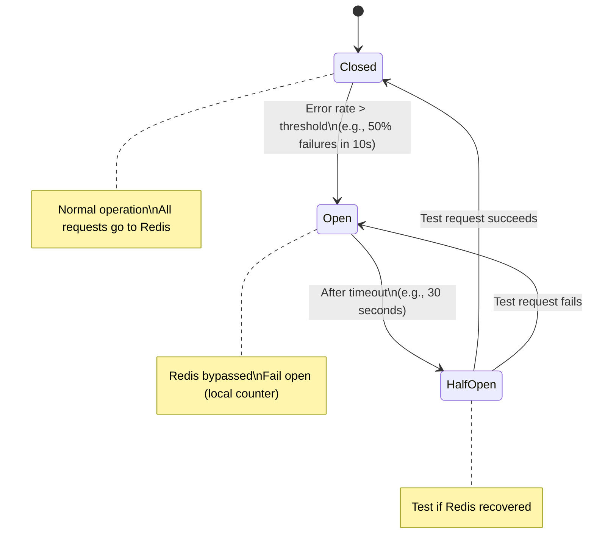

**Implementation:**

```python
class CircuitBreaker:
    def __init__(self, failure_threshold=10, timeout=30):
        self.failure_count = 0
        self.failure_threshold = failure_threshold
        self.timeout = timeout
        self.state = "CLOSED"  # CLOSED, OPEN, HALF_OPEN
        self.last_failure_time = None

    def call(self, func, *args, **kwargs):
        if self.state == "OPEN":
            if time.time() - self.last_failure_time > self.timeout:
                self.state = "HALF_OPEN"
            else:
                return self._fallback(*args, **kwargs)

        try:
            result = func(*args, **kwargs)
            self._on_success()
            return result
        except Exception as e:
            self._on_failure()
            return self._fallback(*args, **kwargs)

    def _on_success(self):
        self.failure_count = 0
        self.state = "CLOSED"

    def _on_failure(self):
        self.failure_count += 1
        self.last_failure_time = time.time()
        if self.failure_count >= self.failure_threshold:
            self.state = "OPEN"

    def _fallback(self, user_id, *args, **kwargs):
        # Local in-memory fallback counter
        return local_rate_limiter.check(user_id)
```

### Local In-Memory Fallback

Each Rate Limiter node maintains a local approximate counter as a fallback:

```python
from collections import defaultdict
import threading

class LocalFallbackLimiter:
    """
    Approximate local rate limiter used when Redis is unavailable.
    Not shared across nodes — used only as a best-effort fallback.
    """
    def __init__(self):
        self.counters = defaultdict(int)
        self.windows = {}
        self.lock = threading.Lock()

    def check(self, user_id: str, limit: int, window_sec: int) -> bool:
        now = int(time.time())
        window_key = now // window_sec
        key = f"{user_id}:{window_key}"

        with self.lock:
            self.counters[key] += 1
            return self.counters[key] <= limit
```

---

## 10. API Contract

### HTTP Response Headers

When a request is **allowed:**

```http
HTTP/1.1 200 OK
X-RateLimit-Limit: 100
X-RateLimit-Remaining: 73
X-RateLimit-Reset: 1710000060
X-RateLimit-Policy: 100;w=60
```

When a request is **throttled:**

```http
HTTP/1.1 429 Too Many Requests
Content-Type: application/json
X-RateLimit-Limit: 100
X-RateLimit-Remaining: 0
X-RateLimit-Reset: 1710000060
Retry-After: 47

{
  "error": {
    "code": "RATE_LIMIT_EXCEEDED",
    "message": "You have exceeded 100 requests per minute.",
    "limit": 100,
    "window": "60s",
    "retry_after_seconds": 47,
    "docs_url": "https://api.example.com/docs/rate-limits"
  }
}
```

### Header Definitions

| Header | Description | Example |
|--------|-------------|---------|
| `X-RateLimit-Limit` | Total allowed requests in window | `100` |
| `X-RateLimit-Remaining` | Requests left in current window | `73` |
| `X-RateLimit-Reset` | Unix timestamp when window resets | `1710000060` |
| `Retry-After` | Seconds until next request is allowed | `47` |
| `X-RateLimit-Policy` | Machine-readable policy string | `100;w=60` |

### Internal gRPC API (for microservices)

```protobuf
syntax = "proto3";

service RateLimiterService {
  // Check if a request is allowed
  rpc CheckRateLimit(RateLimitRequest) returns (RateLimitResponse);
  
  // Batch check for multiple clients
  rpc BatchCheckRateLimit(BatchRateLimitRequest) returns (BatchRateLimitResponse);
}

message RateLimitRequest {
  string client_id = 1;         // user_id, api_key, or IP
  string endpoint = 2;          // /api/search
  string method = 3;            // GET, POST
  map<string, string> labels = 4; // extra context (tenant_id, region, etc.)
}

message RateLimitResponse {
  bool allowed = 1;
  int32 limit = 2;
  int32 remaining = 3;
  int64 reset_timestamp = 4;    // Unix epoch seconds
  int32 retry_after_seconds = 5;
  string policy_id = 6;         // which rule matched
}
```

---

## 11. Client SDK Design

Internal microservices should use a thin SDK, not call the rate limiter directly. The SDK abstracts retry logic, fallback, and header parsing.

```python
# rate_limiter_sdk.py

from dataclasses import dataclass
from typing import Optional
import grpc

@dataclass
class RateLimitResult:
    allowed: bool
    remaining: int
    reset_at: int  # Unix timestamp
    retry_after_seconds: Optional[int] = None
    policy_id: Optional[str] = None

class RateLimiterClient:
    """
    Thread-safe SDK for consuming the Rate Limiter Service.
    Handles: connection pooling, circuit breaking, local fallback.
    """

    def __init__(self, host: str, port: int, timeout_ms: int = 5):
        self.stub = RateLimiterServiceStub(
            grpc.insecure_channel(f"{host}:{port}")
        )
        self.timeout_ms = timeout_ms
        self.circuit_breaker = CircuitBreaker(
            failure_threshold=10,
            timeout_sec=30
        )
        self.local_fallback = LocalFallbackLimiter()

    def check(self, client_id: str, endpoint: str) -> RateLimitResult:
        """
        Returns RateLimitResult. Never throws — falls back gracefully.
        """
        def _call():
            response = self.stub.CheckRateLimit(
                RateLimitRequest(client_id=client_id, endpoint=endpoint),
                timeout=self.timeout_ms / 1000
            )
            return RateLimitResult(
                allowed=response.allowed,
                remaining=response.remaining,
                reset_at=response.reset_timestamp,
                retry_after_seconds=response.retry_after_seconds,
                policy_id=response.policy_id
            )

        return self.circuit_breaker.call(_call)

    def enforce(self, client_id: str, endpoint: str):
        """
        Raises RateLimitExceeded exception if not allowed.
        Use as a decorator or middleware.
        """
        result = self.check(client_id, endpoint)
        if not result.allowed:
            raise RateLimitExceeded(
                f"Rate limit exceeded. Retry after {result.retry_after_seconds}s",
                result=result
            )

# Usage in a microservice:
rate_limiter = RateLimiterClient(host="rl-service.internal", port=50051)

@app.route("/api/search")
def search():
    rate_limiter.enforce(
        client_id=request.headers.get("X-User-Id"),
        endpoint="/api/search"
    )
    # ... actual search logic
```

### Middleware Pattern (FastAPI / Flask)

```python
# FastAPI middleware
from fastapi import Request, HTTPException
from starlette.middleware.base import BaseHTTPMiddleware

class RateLimitMiddleware(BaseHTTPMiddleware):
    def __init__(self, app, rate_limiter: RateLimiterClient):
        super().__init__(app)
        self.rl = rate_limiter

    async def dispatch(self, request: Request, call_next):
        user_id = request.headers.get("X-User-Id", request.client.host)
        result = self.rl.check(user_id, request.url.path)

        if not result.allowed:
            return JSONResponse(
                status_code=429,
                content={"error": "Rate limit exceeded"},
                headers={
                    "Retry-After": str(result.retry_after_seconds),
                    "X-RateLimit-Reset": str(result.reset_at),
                }
            )

        response = await call_next(request)
        response.headers["X-RateLimit-Remaining"] = str(result.remaining)
        return response
```

---

## 12. Scalability & Deployment

### Capacity Estimates

```
Daily requests:     500M req/day
Average RPS:        500M / 86,400s ≈ 5,800 RPS
Peak RPS (10x):     ~58,000 RPS

Redis ops per req:  2 ops (INCR + EXPIRE)
Peak Redis ops:     58,000 × 2 = 116,000 ops/sec

Single Redis node:  ~100,000 ops/sec
→ Need minimum 2 Redis primary nodes (3 for safety)

RL Node throughput: ~20,000 req/sec per node (with Redis round-trip)
→ Need minimum 3 RL nodes (5 for safety with headroom)
```

### Deployment Architecture

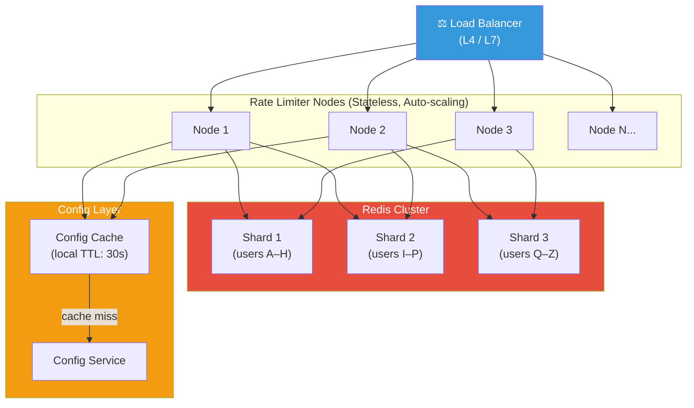

### Sharding Strategy

Rate limiter counters are sharded in Redis using **consistent hashing** on the client ID. This ensures:
- A single user always maps to the same Redis shard
- No cross-shard coordination needed
- Easy to add new shards (only ~1/N keys remapped)

---

## 13. Observability

> You can't fix what you can't see.

### Metrics to Track

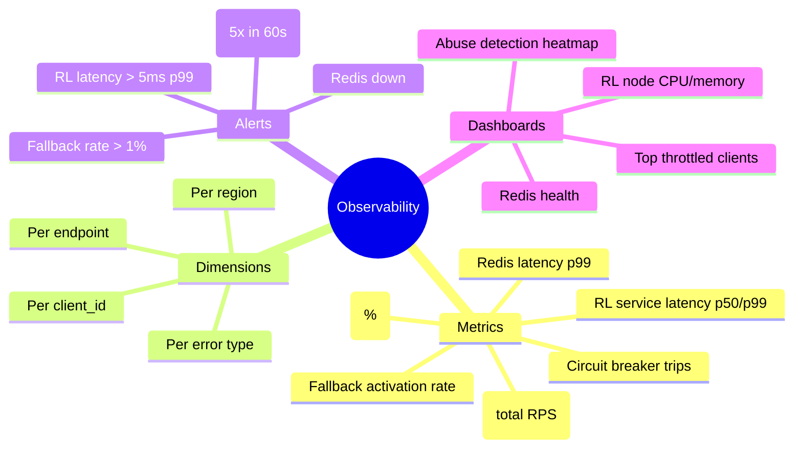

### Prometheus Metrics

```python
from prometheus_client import Counter, Histogram, Gauge

# Request counters
rl_requests_total = Counter(
    "rate_limiter_requests_total",
    "Total rate limit checks",
    ["client_id", "endpoint", "result"]  # result: allowed | rejected
)

# Latency histogram
rl_check_duration = Histogram(
    "rate_limiter_check_duration_seconds",
    "Time spent performing rate limit check",
    buckets=[0.0001, 0.0005, 0.001, 0.005, 0.01]  # 0.1ms to 10ms
)

# Circuit breaker state
rl_circuit_breaker_state = Gauge(
    "rate_limiter_circuit_breaker_open",
    "1 if circuit breaker is open, 0 otherwise"
)

# Redis availability
redis_available = Gauge(
    "rate_limiter_redis_available",
    "1 if Redis is reachable, 0 otherwise"
)

# Usage in code
with rl_check_duration.time():
    result = check_rate_limit(user_id, endpoint)

rl_requests_total.labels(
    client_id=user_id,
    endpoint=endpoint,
    result="allowed" if result.allowed else "rejected"
).inc()
```

### Alert Rules (Prometheus / Alertmanager)

```yaml
# alerts.yml
groups:
  - name: rate_limiter
    rules:

      # Alert if rejection rate spikes suddenly (possible attack or misconfiguration)
      - alert: RateLimiterHighRejectionRate
        expr: |
          rate(rate_limiter_requests_total{result="rejected"}[5m]) /
          rate(rate_limiter_requests_total[5m]) > 0.20
        for: 2m
        severity: warning
        annotations:
          summary: "Rate limiter rejecting >20% of requests"

      # Alert if rate limiter latency degrades
      - alert: RateLimiterHighLatency
        expr: |
          histogram_quantile(0.99,
            rate(rate_limiter_check_duration_seconds_bucket[5m])
          ) > 0.005
        for: 1m
        severity: critical
        annotations:
          summary: "Rate limiter p99 latency above 5ms"

      # Alert if Redis becomes unreachable
      - alert: RateLimiterRedisDown
        expr: rate_limiter_redis_available == 0
        for: 30s
        severity: critical
        annotations:
          summary: "Redis is unreachable — rate limiter in fallback mode"

      # Alert if circuit breaker trips
      - alert: RateLimiterCircuitBreakerOpen
        expr: rate_limiter_circuit_breaker_open == 1
        for: 0m
        severity: critical
        annotations:
          summary: "Circuit breaker is OPEN — Redis unreachable"
```

### Grafana Dashboard Layout

```
┌─────────────────────────────────────────────────────────────┐
│  RATE LIMITER — PRODUCTION DASHBOARD                        │
├─────────────┬─────────────┬─────────────┬───────────────────┤
│  Total RPS  │ Rejected %  │ RL p99 ms   │  Redis Latency    │
│   58,234    │    2.3%     │   0.8ms     │     0.2ms         │
├─────────────┴─────────────┴─────────────┴───────────────────┤
│                                                             │
│  REQUEST RATE BY ENDPOINT (last 1h)    ████████░░░░        │
│  /api/search ██████████████████         42k RPS            │
│  /api/orders ██████                     18k RPS            │
│  /api/users  ████                        9k RPS            │
│                                                             │
├─────────────────────────────────────────────────────────────┤
│                                                             │
│  TOP THROTTLED CLIENTS (last 15min)                        │
│  user_9812     rejected 4,821 times                        │
│  user_3341     rejected 2,109 times                        │
│  api_key_44    rejected 987 times                          │
│                                                             │
├─────────────────────────────────────────────────────────────┤
│  CIRCUIT BREAKER STATE: ✅ CLOSED    FALLBACK: ✅ INACTIVE  │
└─────────────────────────────────────────────────────────────┘
```

---

## 14. Advanced Topics

### Multi-Window Rate Limiting

Real systems use multiple simultaneous windows for better protection:

```
/api/search limits:
  → 10 requests per second (burst protection)
  → 500 requests per minute (sustained protection)
  → 10,000 requests per day (quota protection)

All three must pass for the request to be allowed.
```

```python
def check_multi_window(user_id: str, endpoint: str) -> RateLimitResult:
    rules = config.get_rules(endpoint)  # get all windows for endpoint
    
    results = []
    for rule in rules:
        result = check_single_window(user_id, endpoint, rule)
        results.append(result)
        if not result.allowed:
            # Return the most restrictive rejection
            return result
    
    # Return the most constrained remaining
    return min(results, key=lambda r: r.remaining)
```

### Distributed Rate Limiting with Redis Cluster (Key Hashing)

```python
def get_redis_shard(user_id: str) -> Redis:
    """
    Consistent hashing to select the right Redis shard.
    Ensures same user always goes to same shard.
    """
    shard_index = hash(user_id) % len(redis_shards)
    return redis_shards[shard_index]
```

### Rate Limit Rule Storage

Rules should be stored separately and cached:

```yaml
# rate_limit_rules.yaml — stored in Config DB
rules:
  - id: rule_001
    name: "Default user rate limit"
    match:
      client_type: user
    limits:
      - window: 1s
        max_requests: 10
      - window: 60s
        max_requests: 300
      - window: 86400s
        max_requests: 10000

  - id: rule_002
    name: "Search endpoint — tighter limit"
    match:
      client_type: user
      endpoint: /api/search
    limits:
      - window: 1s
        max_requests: 3
      - window: 60s
        max_requests: 60

  - id: rule_003
    name: "Premium API tier"
    match:
      client_type: api_key
      tier: premium
    limits:
      - window: 60s
        max_requests: 10000
```

### Adaptive Rate Limiting

For sophisticated systems, dynamically adjust limits based on server load:

```
If server CPU > 80% → tighten limits by 20%
If server CPU < 40% → loosen limits by 10%
If error rate > 5%  → cut limits in half immediately
```

---

## 15. Interview Cheat Sheet

> Print this. Memorize it. Use it in interviews.

### The Golden Flow

```
1. CLARIFY   → Who? What window? Hard/soft? Scale? Failure strategy?
2. ALGORITHM → Token Bucket (burst) or Sliding Window Counter (accuracy)
3. STORAGE   → Redis Cluster (atomic INCR, TTL, distributed)
4. ATOMICITY → Lua scripts for multi-step, INCR for single-step
5. FAILURE   → Circuit breaker + fail-open + local fallback
6. API       → 429, Retry-After, X-RateLimit-* headers
7. OBSERVE   → Rejection rate, latency p99, Redis health
```

### Common Interview Questions

| Question | Key Answer |
|----------|-----------|
| Why Redis over a DB? | Sub-ms latency, atomic INCR, native TTL, distributed |
| How do you handle race conditions? | Atomic INCR, or Lua scripts for multi-step |
| What if Redis goes down? | Circuit breaker → fail open → local in-memory counter |
| Sliding window vs Token bucket? | Sliding = accuracy; Token bucket = burst handling |
| How do you scale the rate limiter? | Stateless RL nodes + Redis Cluster with consistent hashing |
| How do you know it's working? | Metrics: rejection rate, latency p99, fallback rate |
| How do you avoid single point of failure? | Redis Cluster (primary + replicas), multiple RL nodes behind LB |

### Numbers to Remember

| Metric | Value |
|--------|-------|
| Redis single-node throughput | ~100,000 ops/sec |
| Target RL latency | < 1ms |
| 500M req/day in RPS | ~5,800 avg, ~58,000 peak |
| Redis INCR + EXPIRE overhead | ~0.1–0.2ms round-trip (local) |
| Token per user storage | ~50 bytes in Redis |

---

## 📚 Further Reading

- [Stripe's Rate Limiter Blog Post](https://stripe.com/blog/rate-limiters) — How Stripe built their rate limiter
- [Redis Documentation — INCR](https://redis.io/commands/incr/) — Atomic counter operations
- [Cloudflare Blog — Rate Limiting](https://blog.cloudflare.com/counting-things-a-lot-of-different-things/) — Sliding window at Internet scale
- [AWS API Gateway Rate Limiting](https://docs.aws.amazon.com/apigateway/latest/developerguide/api-gateway-request-throttling.html)
- [IETF RFC 6585](https://tools.ietf.org/html/rfc6585) — The official 429 Too Many Requests spec

---

*Study guide generated from a live system design review session.*  
*Follow and comment for more ideas*
